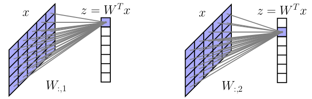
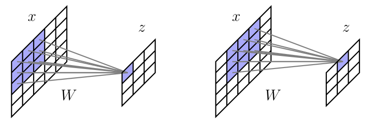
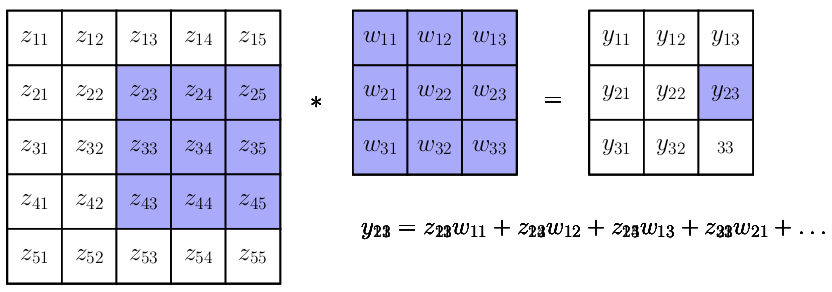
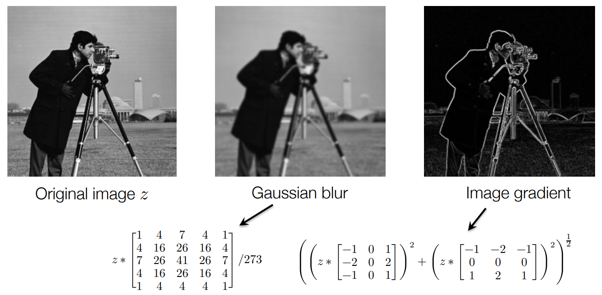
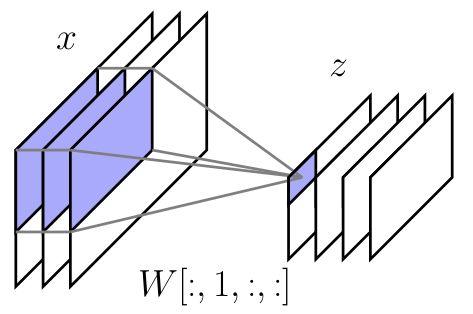
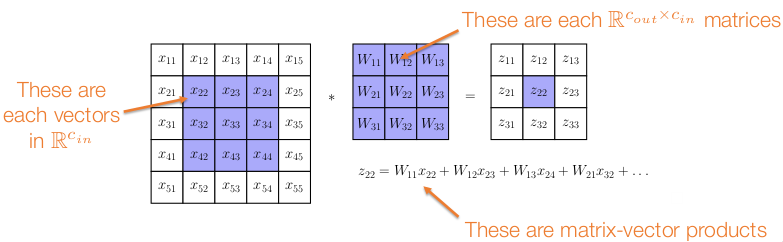
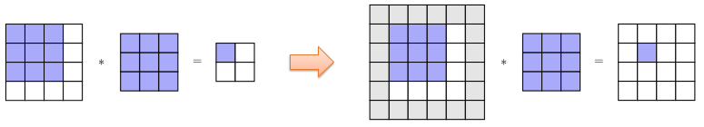
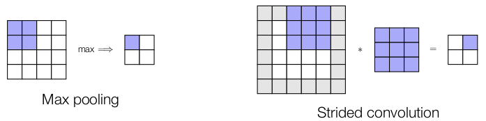
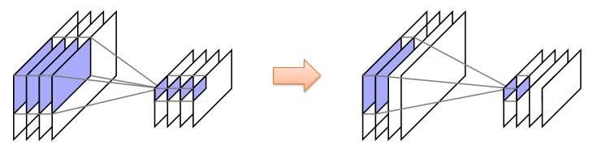
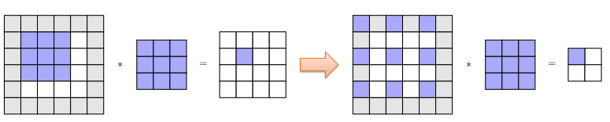

Convolutional Networks

---

# Outline
- Convolutional operators in deep networks
- Elements of practical convolutions
- Differentiating convolutions

---
# Convolutional operators in deep networks
- image, audio

## The problem with fully connected networks
- So far we have considered networks that treat input images as vectors
- This creates a substantial problem as we attempt to handle larger images: a 256x256 RGB image ⟹ ~200K dimensional input ⟹ mapping to 1000 dimensional hidden vector requires 200M parameters (for a single layer)
- Does not capture any of the “intuitive” invariances that we expect to have in
images (e.g., shifting image one pixel leads to very different next layer)



## How convolutions “simplify” deep networks
- Convolutions combine two ideas that are well-suited to processing images
  - 1. Require that activations between layers occur only in a “local” manner, and treat hidden layers themselves as spatial images
    - use partial instead of whole
  - 2. Share the same weights across all spatial locations
    - weights are hiden layer



## Advantages of convolutions

- Drastically reduces the parameter count
  - 256x256 grayscale image ⟹ 256x256 single-channel hidden layer: 4 billion parameters in fully connected network to 9 parameters in 3x3 convolution
  - gain parameter efficiency
- Captures (some) “natural” invariances
  - Shifting input image one pixel to the right shifts creates a hidden shifts the hidden unit “image”

## Convolutions in detail

- Convolutions are a basic primitive in many computer vision and image processing algorithms
- Idea is to “slide” the weights 𝑘×𝑘 weight 𝑤 (called a filter, with kernel size 𝑘) over
the image to produce a new image, written 𝑦 = 𝑧 ∗ 𝑤
  - y11 = z11w11+z12w12+z13w13 + z21w21+z22w22+z23w23 + z31w31+z32w32+z33w33



## Convolutions in image processing
- Convolutions (typically with prespecified filters) are a common operation in many computer vision applications: convolution networks just move to learned filters
  - as a core operation for sort of doing image processing and image manipulation

  - Gaussian function that exponential of the xy position squared and divided by some number, get all the sort of 25 pixels around that location
  - blured image: each pixel is a combination of pixels around that location in the previous image
  $$
  \begin{bmatrix}
  -1 & 0 & 1 \\ 
  -2 & 0 & 2 \\ 
  -1 & 0 & 1 \\ 
  \end{bmatrix}
  $$
  - the filter means how much the image is changing in the x direction and output sorts
  $$
  \begin{bmatrix}
  -1 & -2 & -1 \\ 
  0 & 0 & 0 \\ 
  1 & 2 & 1 \\ 
  \end{bmatrix}
  $$
  - the filter means how much the image is changing in the y direction and output sorts
  - highlighting those portions of the image where the image changes a lot; therefore have high magnitude of the image gradient

## Convolutions in deep networks
- Convolutions in deep networks are virtually always multi-channel convolutions:
- map multi-channel (e.g., RGB) inputs to multi-channel(same number of input channel) hidden units
  - 𝑥 ∈ ℝ ℎ×𝑤×𝑐_𝑖𝑛 denotes 𝑐_𝑖𝑛 channel, size ℎ×𝑤 image input
  - 𝑧 ∈ ℝ ℎ×𝑤×𝑐_𝑜𝑢𝑡 denotes 𝑐_𝑜𝑢𝑡 channel, size ℎ×𝑤 image input
  - 𝑊 ∈ ℝ 𝑐_𝑖𝑛×𝑐_𝑜𝑢𝑡×𝑘×𝑘 (order 4 tensor) denotes convolutional filter
- Multi-channel convolutions contain a convolutional filter for each input-output channel pair, single output channel is sum of convolutions over all input channels

  $$ z[:,:,s] = \sum_{r=1}^{C_{in}} x[:,:,r] * W[r,s,:,:] $$



## Multi-channel convolutions in matrix-vector form
- There is, in my view, a more intuitive way to think about multi-channel
- convolutions: they are a generalization of traditional convolutions with scalar
multiplications replaced by matrix-vector products



---

# Elements of practical convolutions

## Padding
- Challenge: “Naïve” convolutions produce a smaller output than input image
- Solution: for (odd) kernel size 𝑘, pad input with (𝑘 − 1)/2 zeros on all sides, results in an output that is the same size as the input
  - Variants like circular padding, padding with mean values, etc



## Strided Convolutions / Pooling
- Challenge: Convolutions keep the same resolution of the input at each layer, don’t naively allow for representations at different “resolutions”
- down sampled
- Solution #1: incorporate max or average pooling layers to aggregate information
  - max pooling
  - average pooling
- Solution #2: slide convolutional filter over image in increments >1 (= stride)
  - stride = 2,2



```
lhs[N,IH,IW,IC]
rhs[KH,KW,IC,OC]
out[N,OH,OW,OC]

for n in range(N):
  for oh in range(OH):
    for ow in range(OW):
      for oc in range(OC):
        out[n,oh,ow,oc] = 0
        for kh in range(KH):
          for kw in range(KW):
            for ic in range(IC):
              out[n,oh,ow,oc] = lhs[n,oh*sh+kh,ow*sw+kw,ic] * rhs[kh,kw,ic,oc]
```

## Grouped Convolutions
- Challenge: for large numbers of input/output channels, filters can still have a large number of weights, can lead to overfitting + slow computation
- Solution: Group together channels, so that groups of channels in output only depend on corresponding groups of channels in input (equivalently, enforce filter weight matrices to be block-diagonal)

  - all IC -> all OC
  - some IC -> some OC
  - elementwise conv

```
lhs[N,IH,IW,IC]
rhs[KH,KW,IC//G,OC]
out[N,OH,OW,OC]

for n in range(N):
  for oh in range(OH):
    for ow in range(OW):
      for oc in range(OC):
        out[n,oh,ow,oc] = 0
        for kh in range(KH):
          for kw in range(KW):
            for g in range(G):
              for ic in range(IC//G):
                out[n,oh,ow,oc] = lhs[n,oh*sh+kh,ow*sw+kw,g*G+ic] * rhs[kh,kw,g*G+ic,oc]
```
- reduce the parameter count of convolutions
  - rhs[KH,KW,IC,OC] -> rhs[KH,KW,IC//G,OC]

## Dilations
- Challenge: Convolutions each have a relatively small receptive field size
  - 1 pixel just relative 3x3 insight
- Solution: Dilate (spread out) convolution filter, so that it covers more of the image(see also: later architectures we will discuss, like self-attention layers); note that getting an image of the same size again requires adding more padding



---

# Differentiating convolutions

## What is needed to differentiate convolution?
- Recall that in order to integrate any operation into a deep network, we need to be able to multiply by its partial derivatives (adjoint operation)
- So if we define our operation
  𝑧 = conv (𝑥, 𝑊)
- how do we multiply by the adjoints
  $$ \overline v \frac{\partial conv(x,W)}{\partial W}, \overline v \frac{\partial conv(x,W)}{\partial x},  $$

## Refresher on differentiating matrix multiplication
- Let’s consider the simpler case of a matrix-vector product operation 𝑧 = 𝑊𝑥
  - $ x\in R^n $
  - $ z\in R^m $
  - $ W\in R^{mxn} $
- Then 𝜕𝑧/𝜕𝑥 = 𝑊 , so we need to compute the adjoint product
  $$ \overline 𝑣 ^𝑇 𝑊 ⟺ 𝑊^𝑇 \overline 𝑣 $$
- In other words, for a matrix vector multiply operation 𝑊𝑥, computing the backwards pass requires multiplying by the transpose 𝑊^𝑇
- So what is the "transpose" of a convolution?

## Convolutions as matrix multiplication: Version 1
- To answer this question, consider a 1D convolution to keep things a bit simpler:
  - $$ 0 x_1 x_2 x_3 x_4 x_5 0 * w_1 w_2 w_3 = z_1 z_2 z_3 z_4 z_5 $$
    - $ z_1 = 0*w_1 + x_1*w_2 + x_2*w_3 $
    - $ z_1 = x_1*w_1 + x_2*w_2 + x_3*w_3 $
    - ...

- We can write a 1D convolution 𝑥 ∗ 𝑤 (e.g., with zero padding) as a matrix multiplication x for some 𝑊̂ properly defined in terms of the filter 𝑤

  $$
  \begin{bmatrix}
  z_1 \\ 
  z_2 \\ 
  z_3 \\ 
  z_4 \\ 
  z_5 \\ 
  \end{bmatrix} 
  = 
  \hat W * x
  =
  \begin{bmatrix}
  w_2 & w_3 & 0 & 0 & 0 \\ 
  w_1 & w_2 & w_3 & 0 & 0 \\
  0 & w_1 & w_2 & w_3 & 0 \\
  0 & 0 & w_1 & w_2 & w_3 \\
  0 & 0 & 0 & w_1 & w_2 \\
  \end{bmatrix}
  \begin{bmatrix}
  x_1 \\ 
  x_2 \\ 
  x_3 \\ 
  x_4 \\ 
  x_5 \\ 
  \end{bmatrix} 
  $$

  $$
  \hat W =
  \begin{bmatrix}
  w_2 & w_3 & 0 & 0 & 0 \\ 
  w_1 & w_2 & w_3 & 0 & 0 \\
  0 & w_1 & w_2 & w_3 & 0 \\
  0 & 0 & w_1 & w_2 & w_3 \\
  0 & 0 & 0 & w_1 & w_2 \\
  \end{bmatrix}
  $$

## The adjoint of a convolution

- So how can we multiply by the transpose 𝑊^T
- Written out as in the previous slide, it’s quite easy:
  $$
  \hat W^T =
  \begin{bmatrix}
  w_2 & w_1 & 0 & 0 & 0 \\ 
  w_3 & w_2 & w_1 & 0 & 0 \\
  0 & w_3 & w_2 & w_1 & 0 \\
  0 & 0 & w_3 & w_2 & w_1 \\
  0 & 0 & 0 & w_3 & w_2 \\
  \end{bmatrix}
  $$
- But notice that the operation 𝑊^T 𝑣 it itself just a convolution with the "flipped" filter: [𝑤_3,𝑤_2, 𝑤_1]; ⟹ adjoint operator
$$ \overline v \frac{\partial conv(x, W)}{\partial x} = conv(\overline v, flip(w)) $$ 
just requires convolving 𝑣 with a the flipped 𝑊 !

## Convolutions as matrix multiplication: Version 2
- What about the other adjoint
$$ \overline v \frac{\partial conv(x, W)}{\partial W} $$ 
- For this term, observe that we can also write the convolution as a matrix-vector product treating the filter as the vector
$$
  \begin{bmatrix}
  z_1 \\ 
  z_2 \\ 
  z_3 \\ 
  z_4 \\ 
  z_5 \\ 
  \end{bmatrix} 
  = 
  \hat x * w
  =
  \begin{bmatrix}
  0 & x_1 & x_2 \\ 
  x_1 & x_2 & x_3 \\ 
  x_2 & x_3 & x_4 \\
  x_3 & x_4 & x_5 \\
  x_4 & x_5 & 0 \\
  \end{bmatrix}
  \begin{bmatrix}
  w_1 \\ 
  w_2 \\ 
  w_3 \\
  \end{bmatrix} 
  $$

  - $
  \hat x = \begin{bmatrix}
  0 & x_1 & x_2 \\ 
  x_1 & x_2 & x_3 \\ 
  x_2 & x_3 & x_4 \\
  x_3 & x_4 & x_5 \\
  x_4 & x_5 & 0 \\
  \end{bmatrix}
  $
- So adjoint requires multiplying by the transpose of this 𝑥-based matrix (actually a relatively practical approach, see future lecture on the “im2col” operation)
- Z = XW
- $ \frac{\partial Z}{\partial W} = X $