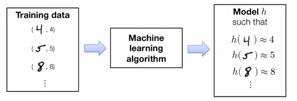
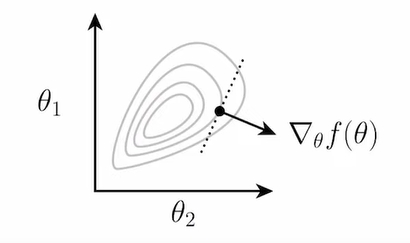
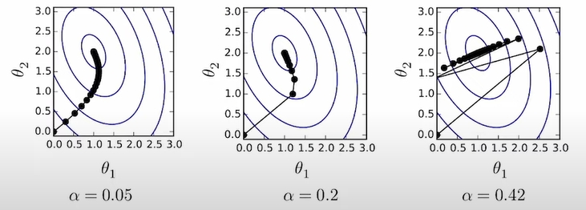

# Algorithms and Implementation
  - https://dlsyscourse.org/
    - https://dlsyscourse.org/lectures/
  - Carnegie Mellon University

---
---

# Lecture 1 - Introduction and Logistics
  - 20220830
  - J.Zico Kolter

## Outline
  - why study deep learning systems?
  - course info and logistics

## Aim of this course
  - This course will provide you will an introduction to the functioning of modern deep learning systems
  - You will learn about the underlying concepts of modern deep learning systems like automatic differentiation, neural network architectures, optimization, and efficient operations on systems like GPUs
  - To solidify your understanding, along the way (in your homeworks), you will build(from scratch) needle, a deep learning library loosely similar to PyTorch, and implement many common architectures in the library

## why study deep learning?
  - AlexNet, 2012, classification
  - AlphaGo, 2016, game
  - StyleGAN, 2018, GAN
  - GPT-3, 2021, write
  - AlphaFold 2, 2021, 3D
  - Stable Diffusion(DALLE-2), 2022, paint

## ...Not(just) for the "big players"
  - DeOldify, 2018, color
  - PyTorch Image Models, 2021, Ross Wightman
    - https://github.com/rwightman/pytorch-image-models.git
  - many community-driven libraries/framworks
    - dmlc
    - mxnet
    - tvm
    - 

## Working on deep learning ten years ago
  - 44k lines of code, six months
  - 100 lines of code, A few hours
  - 

## Reason #1: To build deep learning systems
  - Despite the dominance of deep learning libraries and TensorFlow and PyTorch, the playing field in this space is remarkable fluid(see e.g., recent emergence of JAX)
  - You may want to work in developing existing frameworks(virtually all of which are open source), or developing your own new frameworks for specific tasks
  - The class(and some practice) will prepare you to do this

## Reason #2: To use existing systems more effectively
  - Understanding how the internals of existing deep learning systems work let you use them much more efficiently
  - Want to make your custom non-standard run(much) faster in TensorFlow/PyTorch?...you're going to want to understand how these operations are executed
  - Understanding deep learning systems is a "superpower" that will let you accomplish your research aims much more efficiently

## Reason #3: Deep learning systems are fun!
  - Despite their seeming complexity, the core underlying algorithms behind deep learning systems(automatic differentiation + gradient-based optimization) are extremely simple
  - Unlike(say) operating systems, you could probably write a "reasonable" deep learning library in <2000 lines of(dense) code
  - The first time you build your automatic differentiation library, and realize you can take gradient of a gradient without actually knowing how you would even go about deriving that mathematically...

## Course instructors
  - zico kolter
  - Tianqi Chen
    - https://tqchen.com
    - Professor: catalyst
    - Co-founder: OctoML
    - creator of Major Learning Systems
      - tvm
      - mxnet(framework like TensorFlow,PyTorch)
      - dmlc
      - XGBoost(gradient boosting)
  - Google: TensorFlow, JAX, other libraries
  - facebook: PyTorch, Prophet

# Learning objects of the course
  - By the end of this course, you wil...
  - ...understanding the basic functioning of modern deep learning libraries, including concepts like automatic differentiation, gradient-based optimization
  - ...be able to implement several standard deep learning architectures(MLPs, ConvNets, RNNs, Transformers), truly from scatch
  - ...understand how hardware acceleration(e.g., on GPUs) works under the hood for modern deep learning architectures, and be able to develop your own highly efficient code

# Prerequisites
  - In order to take this course, you need to be proficient with:
    - System programming
    - Linear algebra
    - Other mathematical background: e.g., calculus, probability, basic proofs
    - Pythin and C++ developement
    - Basic prior experience with ML
  - If you are unsure about your background, take a look at the first three lectures take a look at Homework 0(released Sep.15); you should be familiar with all the ideas in this homework in order to take the course

# homework
  - https://forum.dlsyscourse.org/

---
---

# Lecture 2 - ML Refresher / Softmax Regression
  - 20220908
  - J.Zico Kolter

# Outline
  - Basics of machine learning
  - Example: softmax regression

# Machine learning as data-driven programming
  - Suppose you want to write a program that will classify handwritten drawing of digits into their appropriate category: 0,1,...,9
  - You could, think hard about the nature of digits, try to determing the logic of what indicates what kind of digit, and write a program to codify this logic
  - Despite being a reasonable coder, I don't think I counld do this very well

# Machine learning as data-driven programming
  - The (supervised) ML approach: colect a training set of images with known labels and feed these into a machine learning algorithm, which will(if done well) automatically product a "program" that solves this task
  - 

# Three ingredients of a machine learning algorithm
  - every machine learning algorithm consists of three different elements:
  - 1. The hypothesis class: the "program structure", parameterized via a set of **parameters**, that describes how we map inputs(e.g., images of digits) to outputs(e.g., class labesl, or probabilities of different class labels)
  - 2. The loss function: a function that specifies how "well" a given hypothesis(i.e., a choice of parameters) performs on the task of interest
  - 3. An optimization method: a procedure for determining a set of parameters that(approximately) minimize the sum of losses over the training set

# Multi-class classification setting
  - Let's consider a k-class classification setting, where we have
    - Training data:
    $$
    \begin{matrix}
    x^{(i)} \in R^n  \\
    y^{(i)} \in \{1,...,k\}  \\
    or i = 1,...,m
    \end{matrix}
    $$
    
    $$
    x^{(i)} = \begin{pmatrix}
    x_1^i \\
    x_2^i \\
    ... \\
    x_n^i \\
    \end{pmatrix}
    $$
    - n = dimensionality of the input data
    - k = number of different classes/labels
    - m = number of points in the trainig set

  - Example: classification of 28x28 MNIST digits
    - n = 28*28 = 784
    - k = 10
    - m = 60,000

# Linear hypothesis function
  - Our hypothesis function maps inputs $$x \in R^n $$ to k-dimensional vectos $$ h:R^n -> R^k $$
    - where $$ h_i^x $$ indicates some measure of "belief" in how much likely the label is to be class i(i.e., "most likely" prediction is coordinate i with largest $$ h_i(x) $$
  - A linear hypothesis function uses a linear operator (i.e. matrix multiplication) for this transformation $$ h_\theta(x) = \theta^Tx $$ for parameters $$\theta \in R^{nxk} $$

  $$
  h(x) = \begin{bmatrix}
  h_1(x) \\
  h_2(x) \\
  ... \\
  h_k(x) \\
  \end{bmatrix}
  $$

  $$ \theta^T[k,n] * x[n,1] =  h_\theta(x)[k,1]$$ 

# Matrix batch notation
  - Often more convenient(and this is how you want to code things for efficency) to write the data and operations in matrix batch form

    $$
    \begin{matrix}
    X \in R^{m \ast n} = \begin{bmatrix}
    {x^{(1)}}^T \\
    {x^{(2)}}^T \\
    ... \\
    {x^{(m)}}^T \\
    \end{bmatrix}
    \end{matrix}
    $$

    $$
    \begin{matrix}
    y \in {\{1,...,k\}}^m = \begin{bmatrix}
    {y^{(1)}} \\
    {y^{(2)}} \\
    ... \\
    {y^{(m)}} \\
    \end{bmatrix}
    \end{matrix}
    $$
  
  - Then the linear hypothesis applied to this batch can be written as
    $$
    h_\theta(X) = \begin{bmatrix}
    {h_\theta(x^{(1)}}^T) \\
    {h_\theta(x^{(2)}}^T) \\
    ... \\
    {h_\theta(x^{(m)}}^T) \\
    \end{bmatrix} = \begin{bmatrix}
    {x^{(1)}}^T\theta \\
    {x^{(2)}}^T\theta \\
    ... \\
    {x^{(m)}}^T\theta \\
    \end{bmatrix} = X\theta
    $$

# Loss function #1: classification error
  - The simplest loss function to use in classification is just the classification error, i.e., whether the classifier makes a mistake a or not
  $$
  l_err(h(x),y) = \left \{ 
  \begin{array}{c}
  0, & if\ argmax_ih_i(x) = y \\ 
  1, & otherwise
  \end{array}
  \right.
  $$

  - we typically use this loss function to access the quality of classifiers
  - Unfortunately, the error is a bad loss function to use for optimization, i.e., selecting the best parameters, because it is not differentiable
  - can not optimize

# Loss function #2: softmax / cross-entripy loss
  - Let's convert the hypothesis function to a "probability" by exponentiating and normalizing its entries(to make them all positive and sum to one)
  $$ z_i = p(label=i) = \frac {exp(h_i(x))}{\sum_{j=1}^kexp(h_j(x))} \Rightarrow z \equiv normalize(exp(h(x))) $$
  $$ softmax(h(x)) = \frac {exp(h_i(x))}{\sum_{j=1}^kexp(h_j(x))} $$
  - Then let's define a loss to be the (negative) log probablity of the true class: this is called softmax or cross-entropy loss
  $$ l_{ce}(h(x),y) = -log_p(label = y) = -h_y(x) + log\sum_{j=1}^kexp(h_j(x))$$

# The softmax regression optimization problem
  - The third ingredient of a machine learning algorithm is a method for solving the associated optimization problem, i.e., the problem of minimizing the average loss on the trainig set
  $$ \min_{\theta} \frac{1}{m}\sum_{j=1}^m l(h_{\theta}(x^{(i)}, y^{(i)}) $$
  - For softmax regression(i.e., linear hypothesis class and softmax loss):
  $$ \min_{\theta} \frac{1}{m}\sum_{i=1}^m l_{ce}(\theta^Tx^{(i)}, y^{(i)}) $$
  - So how do we find $$ \theta $$ that solves this optimization problem?

# Optimization: gradient descent
  - For a matrix-input, scalar output function: 
  $$ f: R^{n \star k} \Rightarrow R $$
  the gradient is defined as the matrix of partial derivatives
  $$ \nabla_{\theta}f(\theta) \in R^{n \star k} = \begin{bmatrix}
  \frac{\alpha f(\theta)}{\alpha \theta_{11}} & ... & \frac{\alpha f(\theta)}{\alpha \theta_{1k}} \\
  & ... \\
  \frac{\alpha f(\theta)}{\alpha \theta_{n1}} & ... & \frac{\alpha f(\theta)}{\alpha \theta_{nk}} \\
  \end{bmatrix}
  $$
  - Gradient points in the direction that most increases f(locally)
  - 
  - The gradient points in the direction of maximal increase
  - To minimize a function, the gradient descent algorithm proceeds by iteratively taking steps in the direction of the negative gradient
  $$ \theta := \theta - \alpha\nabla_{\theta}f(\theta) $$
  where $$ \theta[n,k], \alpha\nabla_{\theta}f(\theta)[n,k], \alpha > 0 $$ is a step size or learning rate
  - 

# Stochastic gradient descent(SGD)
  - If our objective(as is the case in machine learning) is the sum of individual losses, we don't want to compute the gradient using all examples to make a single update to the parameters
  - Instead, take many gradient steps each based upon a minibatch(small partition of the data), to make many parameter update using a single "pass" over data
    - Repeat:
      - Sample a minibatch of data 
      $$ X \in R^{B \star n}, y \in {\{1,...,k\}}^B $$
      - Update parameters 
      $$ \theta := \theta - \frac{\alpha}{B} \sum_{i=1}^B{\nabla_{\theta}l(h_{\theta}(x^{(i)}),y^{(i)})} $$
  - $$ \min_{\theta} \frac{1}{m}\sum_{i=1}^m l(h(x^{(i)}), y^{(i)}) = \sum_{i=1}^n{\nabla_{\theta}l(h(x^{(i)}),y^{(i)})} $$

# The gradient of the softmax objective
  - so, how do we compute the gradient for the software objective?
  $$ \nabla_{\theta}l_{ce}(\theta^{T}x,y) $$
  - Let's start by deriving the gradient of the softmax loss itself: for vector 
  $$ h \in R^k $$
  $$ \frac{\alpha l_{ce}(h,y)}{\alpha h_{i}} = \frac{\alpha}{\alpha h_i}(-h_y + log \sum_{i=1}^{k}exp(h_j) 
  $$
  $$ \frac{\alpha}{\alpha h_i} * -h_y = -1\{i==y\} $$
  $$ \frac{\alpha}{\alpha h_i} * log \sum_{i=1}^{k}exp(h_j) 
  = \frac{\frac{\alpha}{\alpha h_i}(\sum_{j=1}^{k}exp(h_j))}{\sum_{j=1}^{k}exp(h_j)}
  = \frac{exp(h_i)}{\sum_{i=1}^{k}exp(h_j)}
  $$
  - So, in vector form:
  $$ \nabla_{\theta}l_{ce}(h,y) = z - e_y$$
  $$ z = normalize(exp(h)) $$

  - So how we compute the gradient 
  $$ \nabla_{\theta}l_{ce}(\theta^{T}x,y) $$

  - The chain rule of multivariate calculus ... but the dimensions of all the matrices and vectors get pretty cumbersome
  - Approach #1 (a.k.a. the right way): use matrix differential calculus, Jacobians, Kronecker products, and vectorization
  - Approach #2 (a.k.a. the hacky quick way that everyone actually does): Pretend everythin is a scalar, use the typical chain rule, and then rearrange / transpose matrices/vectors to make the sizes work (and check your answer numerically)

# The slide I'm envarrassed to include...
  - Let's compute the "derivative" of the loss:
  $$ \frac{\alpha}{\alpha\theta}l_{ce}(\theta^{T}x,y) $$
  $$ = \frac{\alpha l_{ce}(\theta^Tx,y)}{\alpha\theta^Tx} * \frac{\alpha \theta^T x}{\theta} $$
  $$ = (z-e_y)*x $$

  $$ z = normalize(exp(\theta^T x)) $$
  $$ (z-e_y)[K,1], x[n,1] $$

  - So to make the dimensions work...
  $$ \nabla_{\theta}l_{ce}(\theta^{T}x,y) \in R^{n * k} = x(z-e_y)^T $$
  - Same process works if we use "matrix batch" form of the loss
  $$ \nabla_{\theta}l_{ce}(X\theta,y) \in R^{n * k} = X^T(Z - I_y) $$

  $$ \frac{\alpha}{\alpha\theta}l_{ce}(X\theta,y) 
  = \frac{\alpha l_{ce}(X\theta,y)}{\alpha X\theta} * \frac{\alpha X\theta}{\alpha \theta} 
  = \frac{\alpha X\theta}{(Z-I_y)}
  $$
  $$ z = normalize(exp(X\theta i)) by row $$ 
  (Z-I_y)[m,k]; X[m,k]

# Puttin it all together
  - Despite a fairly complex derivation, we should highly just how simple the final algorithm is
    - Repeat until parameters / loss converges
    - 1. Iterate over minibatches
      
      $$ X \in R^{R*n}, y \in ({1,...,k})^T $$
      of training set
    - 2. Update the parameters
    $$ \theta := \theta - \frac{\alpha}{B}X^T(Z-I_y) $$
  - That is the entirety of the softmax regression algorithm
  - As you will see on the homework, this gets less than 8% error in classifying MNIST digits, runs in a couple seconds
  - Up next time: neural networks (a.k.a. fancier hypothesis classes)