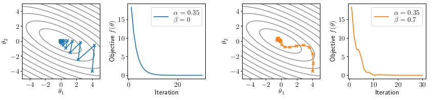

Fully connected networks, optimization, initialization

# Outline
- Fully connected networks
- Optimization
- Initialization

---

# Fully connected networks
- Now that we have covered the basics of automatic differentiation, we can return to “standard” forms of deep networks
- A L-layer, fully connected network, a.k.a. multi-layer perceptron (MLP), now with an explicit bias term, is defined by the iteration
  $$ z_{i+1} = \sigma_i(W_i^Tz_i + b_i), i=1,...,L $$
  
  - a nonlinear function, nonlinear activation:
    $$ \sigma_i $$
  - a linear function of the previous layer:
    $$ W_i^Tz_i $$
  - a bias term
    $$ b_i $$
  - the output of the network is the last value of that iteration:
    $$ h_\theta(x) \equiv z_{L+1} $$
  - repeat this iteration at first L times
  - the first layer = the input of the network
    $$ z_1 \equiv x $$
  
- with parameters $$ \theta = \{ W_{1:L},b_{1:L} \} $$, and where
  - is the nonlinear activation $$ \sigma_i(x) $$ , usually with $$ \sigma_L(x) = x $$
  - a set of all the parameters: $$ \theta $$
  - the last layer just be a linear: $$ \sigma_L(x) = x $$
- $$ Z_i \in R^{n_i} $$
- $$ W_i \in R^{n_i*n_{i+1}} $$
- $$ b_i \in R^{n_{i+1}} $$

# Matrix form and broadcasting subtleties
- Let’s consider the matrix form of the the iteration
  $$ Z_{i+1} = \sigma_i(Z_iW_i + 1b_i^T) $$
  - Zi is a list of activation
    $$ Z_i = 
      \begin{bmatrix}
        {Z_i^1}^T \\
        {Z_i^2}^T \\
        ... \\
        {Z_i^m}^T \\
      \end{bmatrix} 
    $$
  - Z_iW_i[m,n_{i+1}] this is a matrix, can not add a vector(bi) directly , solution is do linear algebra-wise
  - 1[m,1]
  - $$ b_i^T[1,n_{i+1}] $$
  -  $$ 1b_i^T[m,n_{i+1}] $$
    - each row is a copy of bi
      $$ b_i =
        \begin{bmatrix}
          b_i^T \\
          b_i^T \\
          ... \\
          b_i^T \\
        \end{bmatrix} 
      $$
- Notice a subtle point: to write things correctly in matrix form, the update for $$ Z_{i+1} \in R^{m*n} $$ requires that we form the matrix $$ 1b_i^T \in R^{m*n} $$
- In practice, you don’t form these matrices, do not need copy a vector many times, you perform operation via matrix broadcasting
  - E.g. for a n×1 vector (or higher-order tensor), broadcasting treats it(singleton dimensions) as an nxp matrix repeating the same column multiple(p) times
  - We could write iteration (informally) just as $$ Z_{i+1} = \sigma_i(Z_iW_i + b_i^T) $$
  - Matrix broadcasting does not copy any data (described more in later lecture)

# Key questions for fully connected networks
- In order to actually train a fully-connected network (or any deep network), we need to address a certain number of questions:
  - How do we choose the width and depth of the network?
  - How do we actually optimize the objective? (“SGD” is the easy answer, but not the algorithm most commonly used in practice)
  - How do we initialize the weights of the network?
  - How do we ensure the network can continue to be trained easily over multiple optimization iterations?
- All related questions that affect each other 
- There are (still) no definite answers to these questions, and for deep learning they wind up being problem-specific, but we will cover some basic principles

---
# Optimization
- the basic problem that we have of a network, the core optimization problem is minimize the average of our loss of our hypothesis
  $$ \min_{\theta} \frac{1}{m} \sum_{i=1}^{m}l(h_{\theta}(x^i), y^i) $$
  $$ f(\theta) = \frac{1}{m} \sum_{i=1}^{m}l(h_{\theta}(x^i), y^i) $$
  - theta is parameters $$ \theta = {W_{1:L}, b_{1:L}} $$

# Gradient descent
- Let’s reconsider the generic gradient descent updates we described previously, now for a general function f, and writing iterate number t explicitly
  $$ \theta_{t+1} = \theta_t - \alpha \nabla_\theta f(\theta_t) $$
  - t explicit subscripts that indicate which iteration of our algorithm
  - T is going to be the iteration number of out algorithm
  - don't need to store all the parameters from start to T iteration
  - theta means which parameter we're differentiating with respect to
  - theta_t is the value we are evaluating the gradient at

- where alpha > 0 is step size (learning rate)
- the gradient evaluated at the parameters theta_t is:
  $$ \nabla_\theta f(\theta_t) $$ 
- Takes the “steepest descent direction” locally (defined in terms of ℓ2 norm, as we will discuss shortly), but may oscillate over larger time scales

# Illustration of gradient descent
- For $$ \theta \in R^2 $$, consider quadratic function $$ f(\theta) = \frac{1}{2}\theta^TP\theta + q^T\theta $$, for P positive definite (all positive eigenvalues)
- Illustration of gradient descent with different step sizes:

- Picture1
  - $$ \theta \in R^2 \ means \ \theta_1 and \ \theta_2 $$
  - has quadratic term
  - $$ P \in R^{2*2}, \ q \in R^2 $$
- Picture2
  - the evolution of our objective f theta, what's the value of f(theta) at different iterations
- Picture3 & Picture4
  - show the affect with different alpha
    - larger value
      - pros: converge actually fairly quickly
      - cons: bounce around a bit in parameter space
    - smaller alpha
      - pros: don't bounce around as much in parameter space
      - cons: converge more slowly
- question
  - how to converge quickly
  - parameters not change too much
  - trade off the different dimensions
  - how to choose step size

# Newton’s Method
- alternative method
- classical second typically optimization method
- not heavily used in deep learning
- despite being kind of many cases the right approach to traditional optimization, it really does form the backbone for a lot of classical methods in convex optimization
- the idea is to do a similar update to gradient descent, the scaling of the gradient by a matrix(square the gradient)

  $$ \nabla_\theta f(\theta) $$

- One way to integrate more “global” structure into optimization methods is Newton’s method, which scales gradient according to inverse of the Hessian (matrix of second derivatives)
  
  $$ \theta_{t+1} = \theta_t - \alpha (\nabla_\theta^2 f(\theta_t))^{-1}\nabla_\theta f(\theta_t) $$

  - where $$ \nabla_\theta^2 f(\theta_t) $$ is the Hessian, n×n matrix of all second derivatives. gradient was the multivariate analog of the derivate, Hessian is the multivariate analog of the second derivative.
    - a mapping between
      $$ f:R^n -> R $$
    - Hessian is defined as a matrix of sort of all possible second derivatives of this function
      $$ f:R^n -> R, \nabla_\theta^2 f(\theta) = 
      \begin{bmatrix}
        \frac{\partial^2 f_{(\theta)}}{\partial \theta_1^2} &
        \frac{\partial^2 f_{(\theta)}}{\partial \theta_1 \theta_2} &
        ... &
        \frac{\partial^2 f_{(\theta)}}{\partial \theta_1 \theta_n} \\
        
        ... & ... & ... & ... \\

        \frac{\partial^2 f_{(\theta)}}{\partial \theta_n \theta_1} &
        \frac{\partial^2 f_{(\theta)}}{\partial \theta_n \theta_2} &
        ... &
        \frac{\partial^2 f_{(\theta)}}{\partial \theta_n^2}
      \end{bmatrix}
      $$
      - this matrix[nxn], need big storge

- Equivalent to approximating the function as quadratic using second-order Taylor expansion, then solving for optimal solution
- Full Newton step given by α = 1, otherwise less than one called a damped Newton method

# Illustration of Newton’s method
- Newton’s method (will α = 1) will optimize quadratic functions in one step

  
  $$ f(\theta) = \frac{1}{2}\theta^TP\theta + q^T\theta $$
  - quadratic term: $$ \theta^TP\theta $$
  - linear term: $$ q^T\theta $$
  $$ \nabla_\theta f(\theta) = P\theta + q $$
  $$ -> \theta^* = -P^-1 q $$
    - P is Hessian
    - q is gradient
- In some sense, Newton's method is finding the right direction of decsent
- Not of that much practical relevance to deep learning for two reasons
  - 1. We can’t efficiently solve for Newton step, even using automatic differentiation (though there are tricks to approximately solve it)
  - 2. For non-convex optimization, it’s very unclear that we even want to use the Newton direction

# Momentum
- Question: when we had gradient descent and running with a sort of a reasonably large step size here, we kind of bounced around a lot
- Can we find “middle grounds” that are as easy to compute as gradient descent, but which take into account more “global” structure like Newton’s method
- One common strategy is to use momentum update, that takes into account a moving average of multiple previous gradients

  $$ u_{t+1} = \beta u_t + (1-\beta)\nabla_\theta f(\theta_t) $$
    - u is the averaging of kind of the gradients
    - when beta=0, u(t+1) is a linear gradient, so beta has to be less than one: $$ 0 \le \beta < 1 $$
    - Ut is the previous momentum term
    - gradient is $$ \nabla_\theta f(\theta_t) $$
  $$ \theta_{t+1} = \theta_t - \alpha u_{t+1} $$
    - update for momentum, called Polyak momentum  

  $$ u_{t+1} = (1-\beta)\nabla_\theta f(\theta_t) + \beta u_t $$
  $$ u_{t+1} = (1-\beta)\nabla_\theta f(\theta_t) + \beta(1-\beta)\nabla_\theta f(\theta_{t-1}) + \beta^2 u_{t-1} $$ 
  $$ u_{t+1} = (1-\beta)\nabla_\theta f(\theta_t) + \beta(1-\beta)\nabla_\theta f(\theta_{t-1}) + \beta^2(1-\beta)\nabla_\theta f(\theta_{t-2}) + \beta^3u_{t-3} $$ 
  ...
  - geometric sum of all past gradients, so it can capture better direction we actually want to move in
  - u(t) is smaller than gradient

- where α is step size as before, and β is momentum averaging parameter
- Note: often written in alternative forms 
  $$ u_{t+1} = \beta u_t + \nabla_\theta f(\theta_t) $$ 
  or 
  $$ u_{t+1} = \beta u_t + \alpha\nabla_\theta f(\theta_t) $$
  but I prefer above to keep u the same “scale” as gradient

# Illustration of momentum
- Momentum “smooths” out the descent steps, but can also introduce other forms of oscillation and non-descent behavior
- Frequently useful in training deep networks in practice

- we have bouch of history kind of momentum built up, we often overshoot the optimum and things like that but these are just sort of effects
- Momentum is a very common approach in practice

# "Unbiasing" momentum terms
- The momentum term u_t (if initialized to zero, as is common), will be smaller in initial iterations than in later ones
  $$ u_{t+1} = \beta u_t + (1-\beta)\nabla_\theta f(\theta_t) $$
  $$ u_0 = 0 $$
  $$ u_1 = (1-\beta)\nabla_\theta f(\theta_0) $$
  $$ u_2 = (1-\beta)\nabla_\theta f(\theta_1) + \beta (1-\beta)\nabla_\theta f(\theta_0) $$

- To "unbias" the update to have equal expected magnitude across all iterations, we can use the update
  $$ \theta_{t+1} = \theta_t - \frac{\alpha u_t}{1-\beta^{t+1}} $$

- take smaller steps at first becuase you don't have a good estimate of the right direction, so maybe you want to take smaller steps, it's really kind of up to choice

# Nesterov Momentum
- another common momentum, sometimes used in deep learning
- there have many very useful tool, nice theoretical tool, a ton of tricks use to accelerate gradient descent
- One (admittedly, of many) useful tricks in the notion of Nesterov momentum (or Nesterov acceleration), which computes momentum update at “next” point
  $$ u_{t+1} = \beta u_t + (1-\beta)\nabla_\theta f(\theta_t) $$ 
  $$ \theta_{t+1} = \theta_t - \alpha u_t $$
  ->
  $$ u_{t+1} = \beta u_t + (1-\beta)\nabla_\theta f(\theta_t - \alpha u_t) $$ 
  $$ \theta_{t+1} = \theta_t - \alpha u_t $$
  - evaluate gradient and then update based on upon that term

# Adam
- stochastic methods
- use two momentum term, one momentum term to capture the magnitude of the gradient, and another magnitude term to capture the square of the gradient
- The scale of the gradients can vary widely for different parameters, especially e.g. across different layers of a deep network, different layer types, etc
- So-called adaptive gradient methods attempt to estimate this scale over iterations and then re-scale the gradient update accordingly
- Most widely used adaptive gradient method for deep learning is Adam algorithm, which combines momentum and adaptive scale estimation
  $$ u_{t+1} = \beta_1 u_t + (1-\beta_1)\nabla_\theta f(\theta_t) $$

  $$ v_{t+1} = \beta_2 v_t + (1-\beta_2)(\nabla_\theta f(\theta_t))^2 $$
  
  $$ \theta_{t+1} = \theta_t - \frac{\alpha u_{t+1}}{v_{t+1}^{\frac12} + \epsilon} $$

  - u(t) is normal gradient
  - v(t) the average magnitude of this gradient, elementwise squaring, measuring what is the magnitude of each

-  common to use unbiased momentum estimated for both terms 

# Notes on / illustration of Adam
- Whether Adam is “good” optimizer is endlessly debated within deep learning, but it often seems to work quite well in practice (maybe?)
- There are alternative universes where endless other variants became the “standard” (no unbiasing? average of absolute magnitude rather than squared?
- Nesterov-like acceleration?) but Adam is well-tuned and hard to uniformly beat

  - very nicely, after the first step, sort of, accounts for the relative scales of the gradients

# Stochastic variants
- All the previous examples considered batch update to the parameters, but the single most important optimization choice is to use stochastic variants
- Recall our machine learning optimization problem
  
   $$ \min_\theta \frac{1}{m} \sum_{i=1}^{m} l(h_\theta(x^i),y^i) $$
  

- which is the minimization of an empirical expectation over losses
- We can get a noisy (but unbiased) estimate of gradient by computing gradient of the loss over just a subset of examples (called a minibatch)
  
# Stochastic Gradient Descent
- This leads us again to the SGD algorithm, repeating for batches $$ B \in {1,...,m} $$
  - B is subset minibatch  
  $$ \theta_{t+1} = \theta_t - \frac{\alpha}{B} \sum_{i\in B} \nabla_\theta l(h_(x^i),y^i) $$

- Instead of taking a few expensive, noise-free, steps, we take many cheap, noisy steps, which ends having much strong performance per compute

# The most important takeaways
- All the optimization methods you have seen thus far presented are only actually used in their stochastic form
- The amount of valid intuition about these optimization methods you will get from looking at simple (convex, quadratic) optimization problems is limited
- You need to constantly experiment to gain an understanding / intuition of how these methods actually affect deep networks of different types

---

# Initialization of weights
- optimizing a network actually is what do you choose for initial values of Wi and bi, those are parameters in the network
- Recall that we optimize parameters iteratively by stochastic gradient descent, e.g.

  $$ W_i := W_i - \alpha \nabla_{W_i} l(h_\theta(X),y) $$

- But how do we choose the initial values of W_i , b_i ? (maybe just initialize to zero?)
- Recall the manual backpropagation forward/backward passes (without bias):

  $$ Z_{i+1} = \sigma(Z_i W_i) = 0 $$
  $$ G_i = (G_{i+1} \circ \sigma'_i(Z_i W_i))W_i^T = 0 $$
  - if W_i = 0, then G_j = 0 for j<=i
    - $$ \nabla_{W_i}l(h_\theta(X),y) = 0 $$
    - i.e., W_i=0 is a (very bad) local optimum of the objective
  

# Key idea #1: Choice of initialization matters
- Let’s just initialize weights “randomly”, e.g., $$ W_i ∼ N(0, \sigma^2I) $$
  - pick our parameters normally distributed with mean zero
  - some variance sigma squared
- The choice of variance \sigma^2 will affect two (related) quantities:
  - 1. The norm of the forward activations Z_i
  - 2. The norm of the the gradients 
    $$ \nabla_{W_i}l(h_\theta(X),y) $$
- Illustration on MNIST with n = 100 hidden units, depth 50, ReLU nonlinearities 

# Key idea #2: Weights don’t move “that much”
- it doesn't matter where you start, it's important to gathering intuition about what optimization is really doing in networks
- Might have the picture in your mind that the parameters of a network converge to some similar region of points regardless of their initialization
- This is not true ... weights often stay much closer to their initialization than to the “final” point after optimization from different
- End result: initialization matters ... we’ll see some of the practical aspects next lecture

# What causes these effects?
- Consider independent random variables 
  $$ x ∼ N(0,1), w ∼ N(0, \frac{1}{n}) $$
  then
  $$ E[x_i w_i] = E[x_i]E[w_i] = 0 $$
  $$ Var[x_i w_i] = Var[x_i]Var[w_i] = \frac{1}{n} $$
- so $$ E[w^T x] = 0, Var[w^T x] = 1 (w^T x -> N(0,1) $$ by central limit theorem)
- Thus, informally speaking if we used a linear activation and 
  $$ z_i ∼ N(0, I) , W_i ∼ N(0, \frac{1}{n}I $$
  then 
  $$ z_{i+1} = W_i^T z_i ∼ N(0, I) $$
- If we use a ReLU nonlinearity, then “half” the components of z_i will be set to zero, so we need twice the variance on W i to achieve the same final variance, hence
    $$ W_i ∼ N(0, \frac{2}{n}I) $$
- $$ W^T X = \sum_{i=1}^{n}X_i W_i $$

# What causes these effects?
- If σ^2 ≠ 2/n for a ReLU network, then each iteration the variance of the the hidden units increases/decreases geometrically by some factor
  $$ Var[Z_{i+1}] = \gamma ⋅ Var[Z_i] = \gamma^i $$
- This happens for both the forward and backward passes
  $$ Var[G_i] = \gamma ⋅ Var[G_{i+1}] = γ^{D−i} $$
- Thus, we have that (naively), the variance of the gradients will be apprroximately constant over layers, but heavily affected by choice of σ^2 , depth D
  $$ \nabla_{W_i}l(h_\theta(X),y) \propto Z_i^T G_i \propto \gamma^D  $$