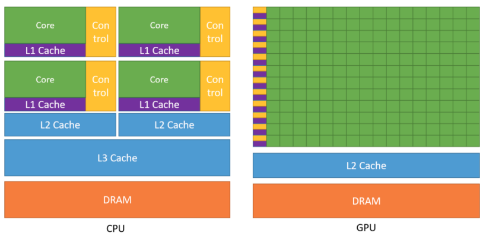
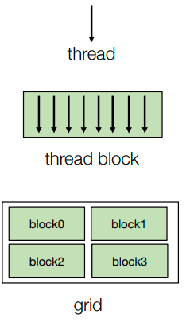
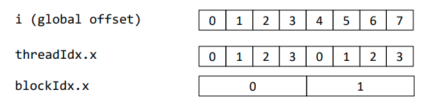
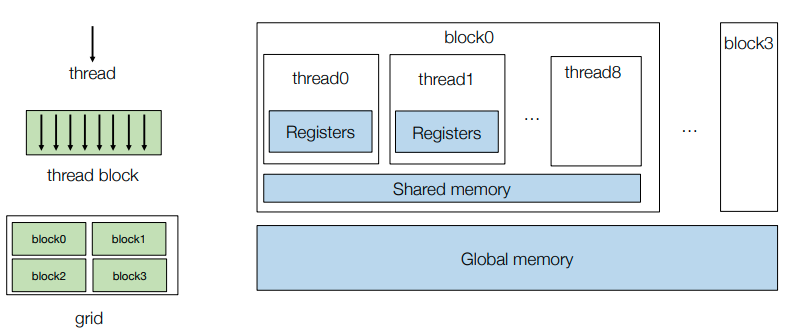
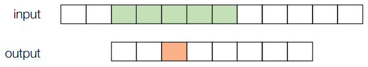
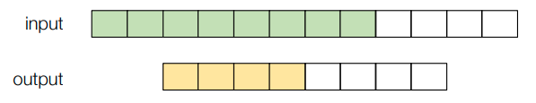
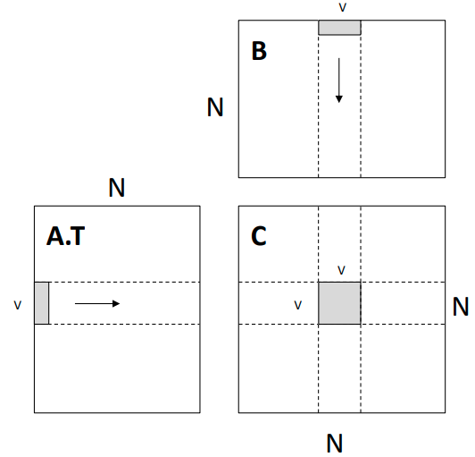
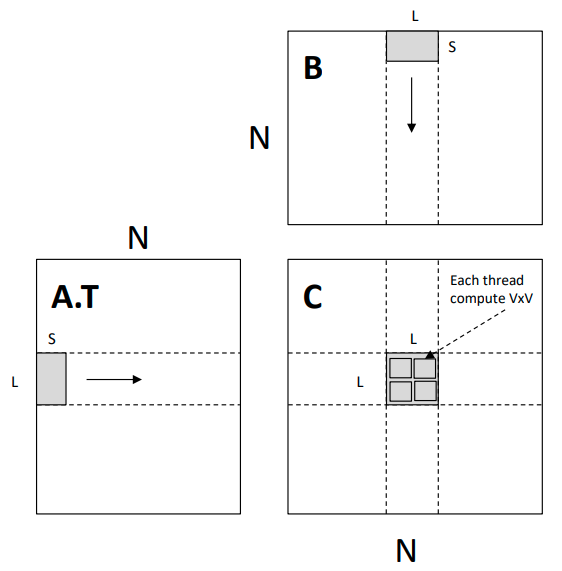

# Outline
- GPU programming
- Case study: matrix multiplication on GPU

---

# GPU programming

## What is a GPU



- Source: CUDA Programming guide
- Massive parallel computing units

## GPU programming mode: SIMT

- Single instruction multiple threads (SIMT)
- All threads executes the same code, but can take different path
- Threads are grouped into blocks
  - Thread within the same block have shared memory
- Blocks are grouped into a launch grid
- A kernel executes a grid 
- NOTE: we will be using the CUDA’s terminology in this lecture. But usually there is a direct mapping of these concepts in other gpu programming models (opencl, sycl, metal) 

## Example: vector add
```
void VecAddCPU(float* A, float *B, float* C, int n) {
  for (int i = 0; i < n; ++i) {
    C[i] = A[i] + B[i];
  }
}
__global__ void VecAddKernel(float* A, float *B, float* C, int n) {
  int i = blockDim.x * blockIdx.x + threadIdx.x;
    if (i < n) {
      C[i] = A[i] + B[i];
    }
  }
```


- Suppose each block includes 4 threads: blockDim.x = 4

## Example: vector add host side
```
__global__ void VecAddKernel(float* A, float *B, float* C, int n) {
  int i = blockDim.x * blockIdx.x + threadIdx.x;
  if (i < n) {
    C[i] = A[i] + B[i];
  }
}

void VecAddCUDA(float* Acpu, float *Bcpu, float* Ccpu, int n) {
  float *dA, *dB, *dC;
  cudaMalloc(&dA, n * sizeof(float));
  cudaMalloc(&dB, n * sizeof(float));
  cudaMalloc(&dC, n * sizeof(float));
  cudaMemcpy(dA, Acpu, n * sizeof(float), cudaMemcpyHostToDevice);
  cudaMemcpy(dB, Bcpu, n * sizeof(float), cudaMemcpyHostToDevice);
  int threads_per_block = 512;
  int nblocks = (n + threads_per_block - 1) / threads_per_block;
  VecAddKernel<<<nblocks, thread_per_block>>>(dA, dB, dC, n);
  cudaMemcpy(Ccpu, dC, n * sizeof(float), cudaMemcpyDeviceToHost);
  cudaFree(dA); cudaFree(dB); cudaFree(dC);
}
```
- Demonstrate the host side launch and device memory allocation. Unlike this example, real applications usually keep data in gpu memory as long as possible.

## Example of other GPU Programming Models
- OpenCL (used in ARM GPU)
```
__kernel void VecAdd(__global float *a, __global float* b, __global float* c, int n) {
  int gid = get_global_id(0)
  if (gid < n) {
    c[gid] = a[gid] + b[gid];
  }
}
```
- Metal (Apple devices)
```
kernel void VecAdd(float* a [[buffer(0)]], float* b [[buffer(1)]], float* c [[buffer(1)]], uint gid [[thread_position_in_grid]], int n) {
  if (gid < n) {
    c[gid] = a[gid] + b[gid];
  }
}
```

## GPU memory hierarchy



## Example: window sum
- Compute the sums over a sliding window of radius=2

```
#define RADIUS 2
__global__ void WindowSumSimpleKernel(float* A, float *B, int n) {
  int out_idx = blockDim.x * blockIdx.x + threadIdx.x;
  if (out_idx < n) {
    float sum = 0;
    for (int dx = -RADIUS; dx <= RADIUS; ++dx) {
      sum += A[dx + out_idx + RADIUS];
    }
    B[out_idx] = sum;
  }
}
```

## Example: window sum with shared memory
- Use thread block of size 4 to cooperatively fetch the data to shared memory


```
__global__ void WindowSumSharedKernel(float* A, float *B, int n) {
  __shared__ float temp[THREADS_PER_BLOCK + 2 * RADIUS];
  int base = blockDim.x * blockIdx.x;
  int out_idx = base + threadIdx.x;
  if (base + threadIdx.x < n) {
    temp[threadIdx.x] = A[base + threadIdx.x];
  }
  if (threadIdx.x < 2 * RADIUS && base + THREADS_PER_BLOCK + threadIdx.x < n) {
    temp[threadIdx.x + THREADS_PER_BLOCK] = A[base + THREADS_PER_BLOCK + threadIdx.x];
  }
  __syncthreads();
  if (out_idx < n) {
    float sum = 0;
    for (int dx = -RADIUS; dx <= RADIUS; ++dx) {
      sum += temp[threadIdx.x + dx + RADIUS];
    }
    B[out_idx] = sum;
  }
}
``` 

## High level takeaways
- Launch thread grid and blocks
- Cooperatively fetch common to shared memory to increase reuse

---

# Case study: matrix multiplication on GPU
## Thread-level: register tiling

- Compute C = dot(A.T, B)

```
__global__ void mm(float A[N][N], float B[N][N], float C[N][N]) {
  int ybase = blockIdx.y * blockDim.y + threadIdx.y;
  int xbase = blockIdx.x * blockDim.x + threadIdx.x;
  float c[V][V] = {0};
  float a[V], b[V];
  for (int k = 0; k < N; ++k) {
    a[:] = A[k, ybase*V : ybase*V + V];
    b[:] = B[k, xbase*V : xbase*V + V];
    for (int y = 0; y < V; ++y) {
      for (int x = 0; x < V; ++x) {
        c[y][x] += a[y] * b[x];
      }
    }
  }
  C[ybase * V : ybase*V + V, xbase*V : xbase*V + V] = c[:];
}

```

## Block-level: shared memory tiling

```
__global__ void mm(float A[N][N], float B[N][N], float C[N][N]) {
  __shared__ float sA[S][L], sB[S][L];
  float c[V][V] = {0};
  float a[V], b[V];
  int yblock = blockIdx.y;
  int xblock = blockIdx.x;
  for (int ko = 0; ko < N; ko += S) {
    __syncthreads();
    // needs to be implemented by thread cooperative fetching
    sA[:, :] = A[k : k + S, yblock * L : yblock * L + L];
    sB[:, :] = B[k : k + S, xblock * L : xblock * L + L];
    __syncthreads();
    for (int ki = 0; ki < S; ++ ki) {
    a[:] = sA[ki, threadIdx.y * V : threadIdx.y * V + V];
    b[:] = sA[ki, threadIdx.x * V : threadIdx.x * V + V];
    for (int y = 0; y < V; ++y) {
      for (int x = 0; x < V; ++x) {
        c[y][x] += a[y] * b[x];
      }
      }
    }
  }
  int ybase = blockIdx.y * blockDim.y + threadIdx.y;
  int xbase = blockIdx.x * blockDim.x + threadIdx.x;
  C[ybase * V : ybase*V + V, xbase*V : xbase*V + V] = c[:];
}
```

## Analysis of memory reuse
- global->shared copy: 2 * N^3 / L
- shared->register: 2 * N^3 / V

## Expand Cooperative Fetching
- sA[:, :] = A[k : k + S, yblock * L : yblock * L + L]; 
- code
```
int nthreads = blockDim.y * blockDim.x;
int tid = threadIdx.y * blockDim.x + threadIdx.x;
for(int j = 0; j < L * S / nthreads; ++j) {
  int y = (j * nthreads + tid) / L;
  int x = (j * nthreads + tid) % L;
  s[y, x] = A[k + y, yblock * L + x];
}
```

## More GPU optimization techniques
- Global memory continuous read
- Shared memory bank conflict
- Software pipelining
- Warp level optimizations
- Tensor Core