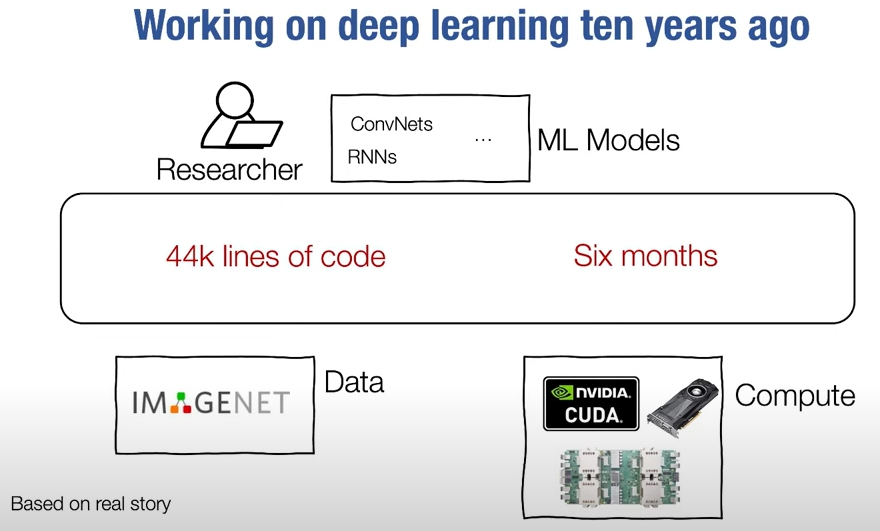

# Algorithms and Implementation
  - https://dlsyscourse.org/
    - https://dlsyscourse.org/lectures/
  - Carnegie Mellon University

---

- HW1: How to scratch auto differentiation library
- HW2: Leverage a numpy linear backward
- HW3: build hardware library to replace numpy

---

# Lecture 1 - Introduction and Logistics
  - 20220830
  - J.Zico Kolter

## Outline
  - why study deep learning systems?
  - course info and logistics

## Aim of this course
  - This course will provide you will an introduction to the functioning of modern deep learning systems
  - You will learn about the underlying concepts of modern deep learning systems like automatic differentiation, neural network architectures, optimization, and efficient operations on systems like GPUs
  - To solidify your understanding, along the way (in your homeworks), you will build(from scratch) needle, a deep learning library loosely similar to PyTorch, and implement many common architectures in the library

## why study deep learning?
  - AlexNet, 2012, classification
  - AlphaGo, 2016, game
  - StyleGAN, 2018, GAN
  - GPT-3, 2021, write
  - AlphaFold 2, 2021, 3D
  - Stable Diffusion(DALLE-2), 2022, paint

## ...Not(just) for the "big players"
  - DeOldify, 2018, color
  - PyTorch Image Models, 2021, Ross Wightman
    - https://github.com/rwightman/pytorch-image-models.git
  - many community-driven libraries/framworks
    - dmlc
    - mxnet
    - tvm
    - 

## Working on deep learning ten years ago
  - 44k lines of code, six months
  - 100 lines of code, A few hours
  - 

## Reason #1: To build deep learning systems
  - Despite the dominance of deep learning libraries and TensorFlow and PyTorch, the playing field in this space is remarkable fluid(see e.g., recent emergence of JAX)
  - You may want to work in developing existing frameworks(virtually all of which are open source), or developing your own new frameworks for specific tasks
  - The class(and some practice) will prepare you to do this

## Reason #2: To use existing systems more effectively
  - Understanding how the internals of existing deep learning systems work let you use them much more efficiently
  - Want to make your custom non-standard run(much) faster in TensorFlow/PyTorch?...you're going to want to understand how these operations are executed
  - Understanding deep learning systems is a "superpower" that will let you accomplish your research aims much more efficiently

## Reason #3: Deep learning systems are fun!
  - Despite their seeming complexity, the core underlying algorithms behind deep learning systems(automatic differentiation + gradient-based optimization) are extremely simple
  - Unlike(say) operating systems, you could probably write a "reasonable" deep learning library in <2000 lines of(dense) code
  - The first time you build your automatic differentiation library, and realize you can take gradient of a gradient without actually knowing how you would even go about deriving that mathematically...

## Course instructors
  - zico kolter
  - Tianqi Chen
    - https://tqchen.com
    - Professor: catalyst
    - Co-founder: OctoML
    - creator of Major Learning Systems
      - tvm
      - mxnet(framework like TensorFlow,PyTorch)
      - dmlc
      - XGBoost(gradient boosting)
  - Google: TensorFlow, JAX, other libraries
  - facebook: PyTorch, Prophet

## Learning objects of the course
  - By the end of this course, you wil...
  - ...understanding the basic functioning of modern deep learning libraries, including concepts like automatic differentiation, gradient-based optimization
  - ...be able to implement several standard deep learning architectures(MLPs, ConvNets, RNNs, Transformers), truly from scatch
  - ...understand how hardware acceleration(e.g., on GPUs) works under the hood for modern deep learning architectures, and be able to develop your own highly efficient code

## Prerequisites
  - In order to take this course, you need to be proficient with:
    - System programming
    - Linear algebra
    - Other mathematical background: e.g., calculus, probability, basic proofs
    - Pythin and C++ developement
    - Basic prior experience with ML
  - If you are unsure about your background, take a look at the first three lectures take a look at Homework 0(released Sep.15); you should be familiar with all the ideas in this homework in order to take the course

## homework
  - https://forum.dlsyscourse.org/

