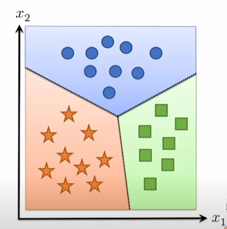
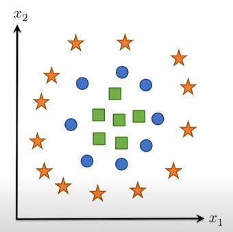

# Part1

## outline
- from linear to nonlinear hypothesis classes
- neural networks
- backpropagation (i.e, computing gradients)

## the trouble with linear hypotheis clasees

- recall that we needed a hypothesis function to map inputs in Rn to outputs(class logits) in Rk, so so we initially used the linear hypothesis class
$$ h_\theta(x) = \theta^Tx, \theta \in R^{nxk} $$
- this classifier essentially forms k linear functions of the input and then predicts the class ith the largest value equivalent to prtitioning the input k linear regions corresponding to each class.

## what about nonlinear classification boundaries?

- what if we have data that cannot be sparated by a set of linear regions?
- we want some way to separate these points via a nonlinear set of class boundaries
- one idea
  - apply a linear classsifier to some (potentially higher-dimensional) features of the data
  $$ h_\theta(x) = \theta^T\phi(x) $$
  $$ \theta \in R^{dxk}, \phi: R^n -> R^d $$
  - function phi here is a function mapping from Rn op Rd
  - Rn is the input space
  - Rd is any other(higher or lower, different) dimension space

- example
  - $$ \phi(x) = x_1^2 + x_2^2 $$

## How do we create features?
- how can we create the feature function phi?
  - 1. through manual engineering of features relevant to the problem (the "old" way of doing machine learning)
  - 2. in a way that itself is learned from data(the "new" way of doing ML)
- first take: what f we just again use a linear function for phi?
$$ \phi(x) = W^Tx $$
$$ W \in R^{nxd} $$
- doesn't work, because it is just equivalent to another linear classifier
$$ h_\theta(x) = \theta^T\phi(x) = \theta^TW^Tx = \hat\theta^Tx$$
$$ \theta^TW^T \in R^{kxn} $$

## nonlinear features
- but what does work? ...essentially any nonliear function of linear features
$$ \phi(x) = \sigma(W^Tx) $$
  - where W in R(nxd)
  - function sigma(map Rd -> Rd) is essentially any nonlinear function
  - this is a two-layer network

- example
  - let W be a fixed matrix of random Gaussian samples, and let sigma be the cosine function -> "random fourier features" (work great for many problems)
- but maybe we want to train W to minimize loss as well? Or maybe we want to compose multiple features together?

## neural networks / deep learning
- a neural network refers to a particular type of hypothesis class, consisting of **multiple, parameterized differentiable functions(a.k.a. "layers") composed together in any manner to form the output**
- the term stems from blological inspiration, but at this point, literally any hypothesis funtion of the type above is referred to as a neural network
- "deep network" is just a synonym for "neural network", and "deep learning" just means "machines learning using a neural network hypothesis class" (let's cease pretending that there is any requirements on depth beyond "just no linear")
  - but it's also true that modern neural networks involve composing together a lot of functions. so "deep" is typically an appropriate qualifier

## the "two layer" neural network
- we can begin with the simplest form of neural network, basically just the nonlinear features proposed earlier, but where both sets of weights are learnable parameters
$$ h_\theta(x) = W_2^T \sigma(W_1^Tx)  $$
$$ \theta = {W_1 \in R^{nxd}, W_2 \in R^{dxk}} $$
- where sigma function: R -> R is a nonlinear function applied elementwise to the vector (e.g. sigmoid, relu)
- written in batch matrix form
$$ h_\theta(X) = \sigma(XW_1)W_2 $$
  - X[m,n]
  - W1[n,d]
  - W2[d,k]
  - XW1[m,d]
  - XW1W2[m,k]

## universal function approximation
- theorem(1D case): given any smooth function: f:R->R, closed region D in R, and >0, we can construt a one-hidder-layer neural network f' such that
  $$ \max_{x \in D} |f(x)- \hat f(x)| \le \epsilon  $$
- proof: select some dense sampling of points(x(i), f(x(i))) over D, create a neural network that passes exactly these points(see next slice). Because the neural network function is piecewise linear, and the function f is smooth, by choosing the x(i) close enough together, we can approximate the function arbitrarily closely.

- how do we form a neural network
  - sample this function forming a linear spline approxiamation to this function
  -arbitrary large, not practical

## universal function approximation
- assume ont-hidden-layer RELU network (/bias)
$$ \hat f(x) = \sum_{i=1}^d +- max{0, w_ix+b_i} $$
- visual construction of approximating function

## fully-connected deep networks
- a more generic form of a L-layer neural network - a.k.a. "multi-layer perceptron"(MLP), feedforward network, fully-connected network - (in batch form)
$$ Z_{i+1} = \sigma_i(Z_iW_i + b_i),i=1,...,L $$
$$ Z_1 = X $$
$$ h_\theta(X) = Z_{L+1} $$
$$ [Zi \in R^{mxn}, W_i \in R^{n_ixn_{i+1}}] $$

- with nonlinearities
$$ \sigma_i:R->R $$
applied elementwise and parameters
$$ \theta = {W_1,...,W_L} $$
(can also optionallly add bias term)

## why deep networks
- the work like the brain
  - no they don't
- deep circuits are provably more efficient
  - at representing functions nerual networks cannot actually learn(e.g. parity)
- empirically it seems like they work better for a fixed parameter count

##  how to training a network

--- 

# part2
## neural networks in machine learning
- recall that neural networks just specify one of the "three" ingredients of a machine learning algorithm, also need:
  - loss function: still cross entropy loss, like last time
  - optimization procedure: still stochastic gradient descent(SGD), like last time
- in other ords, we still want to solve the optimization problem
  $$ \min_\theta \frac{1}{m} \sum_{i=1}^m l_{ce} (h_\theta (x^i),y^i) $$
- y^i is true value
- using SGD, just with h_theta(x) now being a neural network
- requires computing the gradients 
  $$ \nabla_\theta l_{ce}(h_\theta (x^i),y^i) $$ 
  - for each  element of theta

## The gradient(s) of a two-layer network
- let's work through the derivation of the gradients for a simple two-layer network, written in batch matrix form, i.e.,
  $$ \nabla_{\{w_1,w_2\}} l_{ce}(\sigma(XW_1)W_2,y) $$ 
- the gradient w.r.t W2 looks identical to the softmax regression case:
  $$ \frac{\partial l_{ce}(\sigma(XW_1)W_2,y)}{\partial W_2} $$
  $$ = \frac{\partial l_{ce}(\sigma(XW_1)W_2,y)}{\partial \sigma(XW_1)W_2} \bullet  \frac{\partial \sigma(XW_1)W_2}{\partial W_2} $$
  $$ = (S-I_y) \bullet \sigma(XW_1) $$
  $$ S=normalize(exp(h_\theta(x)))=normalize(exp(\sigma(XW_1)W_2)) $$
    $$ (S-I_y)[m,k] $$
    $$ \sigma(XW_1)[m,d] $$

- so (matchine size) the gradient is:
  $$ \nabla_{w_1} l_{ce}(\sigma(XW_1)W_2,y) = \sigma(XW_1)^T \bullet (S-I_y) $$ 
  - gradient[d,k]

- deep breath and let's do the gradient w.r.t. W1...
  - based on chaining rule
  $$ \frac{\partial l_{ce}(\sigma(XW_1)W_2,y)}{\partial W_1} $$
  $$ = \frac{\partial l_{ce}(\sigma(XW_1)W_2,y)}{\partial \sigma(XW_1)W_2} \bullet \frac{\partial \sigma(XW_1)W_2}{\partial \sigma(XW_1)} \bullet \frac{\partial \sigma(XW_1)}{\partial XW_1} \bullet \frac{\partial XW_1}{\partial W_1} $$
  = $$ (S-I_y) \bullet W_2 \bullet \sigma'(XW_1) \bullet X $$
    $$ (S-I_y)[m,k] $$
    $$ W_2[d,k] $$
    $$ \sigma'(XW_1)[m,d] $$
    $$ X[m,n] $$

- and so the gradient is
  $$ \nabla_{w_1} l_{ce}(\sigma(XW_1)W_2,y) = \sigma(XW_1)^T \bullet (S-I_y) $$
  $$ = X^T \bullet \sigma'(XW_1) \ast (S-I_y)W_2^T $$ 
    $$ gradient[n,d] $$
    $$ X^T[n,m] $$
    $$ \sigma'(XW_1)[m,d] $$
    $$ (S-I_y)W_2^T[m,d] $$
    - where \ast denotes elementwise multiplication

- ...having fun yet?

# backpropagation "in general"
- there is a method to this madness...consider out fully-connected network:
  $$Z_{i+1} = \sigma_i(Z_iW_i), i=1,...,L $$
- then (now being a bit terse with notation)
  $$ \frac{\partial l(Z_{L+1},y)}{\partial W_i} = $$
  $$ = \frac{\partial l}{\partial Z_{L+1}} 
  \bullet \frac{\partial Z_{L+1}}{\partial Z_L} 
  \bullet \frac{\partial Z_L}{\partial Z_{L-1}}
  \bullet ...
  \bullet \frac{\partial Z_{i+2}}{\partial Z_{i+1}}
  \bullet \frac{\partial Z_{i+1}}{\partial W_i}
  $$

  $$
  G_{i+1} = \frac{\partial l(Z_{L+1},y)}{\partial Z_{i+1}}
  $$

- then we have a simple "backward" iteration to compute the Gi's
  $$
  G_i = G_{i+1} 
  \bullet \frac{\partial Z_{i+1}}{\partial Z_i}
  = G_{i+1} 
  \bullet \frac{\partial \sigma (Z_iW_i)}{\partial Z_iW_i}
  \bullet \frac{\partial Z_iW_i}{\partial Z_i}
  = G_{i+1}\bullet \sigma'(Z_iW_i) \bullet W_i
  $$

## computing the real gradients
- to convert these quantities to "real" gradients, consider matrix sizes
  $$
  G_i = \frac{\partial l(Z_{L+1},y)}{\partial Z_i} = \nabla_{Z_1}l(Z_{L+1,y}) \in R^{m,n_i}
  $$

  $$ Z_i \in R^{m,n_i}$$

- so with "real" matrix operations
  $$
  G_i = G_{i+1} 
  \bullet \sigma'(Z_iW_i)
  \bullet W_i 
  =
  (G_{i+1} 
  \ast \sigma'(Z_iW_i))
  \bullet W_i^T
  $$
  $$ G_{i+1}[m,n_{i+!}] $$
  $$ \sigma'(Z_iW_i)[m,n_{i+1}] $$
  $$ W_i[n_i,n_{i+1}]$$
  $$ W_i^T[n_{i+1},n_i]$$
  $$ (G_{i+1} 
  \ast \sigma'(Z_iW_i))[m,n_{i+1}] $$

- similiar formula for actual parameter gradients 
  $$ \nabla_{w_i}l(Z_{L+1,y}) \in R^{n_i,n_[i+1]} $$
  $$ \frac{\partial l(Z_{L+1},y)}{\partial W_i} = 
  G_{i+1} 
  \bullet \frac{\partial Z_{i+1}}{\partial W_i}
  = G_{i+1} 
  \bullet \frac{\partial \sigma (Z_iW_i)}{\partial Z_iW_i}
  \bullet \frac{\partial Z_iW_i}{\partial W_i}
  = G_{i+1}\bullet \sigma'(Z_iW_i) \bullet Z_i
  $$
    $$ G_{i+1}[m,n_{i+1}] $$
    $$ \sigma'(Z_iW_i)[m,n_{i+1}] $$
    $$ Z_i[m,n_i] $$

  $$
  \nabla_{W_i}l(Z_{L+1},y)
  = Z_i^T(G_{i+1} \ast \sigma'(Z_iW_i)) 
  $$

## backpropagation: forward and backward passes
- putting it all together, we can efficiently compute all the gradients we need for a neural network by following the procedure below:
  - 1. forward pass
    - initialize: $$ Z_i = X $$
    - iterate: $$ Z_{i+1} = \sigma_i(Z_iW_i), i=1,...,L $$
  - 2. backward pass
    - initialize: $$ G_{L+1} = \nabla_{Z_{L+1}}l(Z_{L+1},y) = S - I_y $$
    - iterate: $$ G_{i} = (G_{i+1} \ast \sigma'(Z_iW_i))W_i^T, i=L,...,1 $$
- and we can compute all the needed gradients along the way
  $$ \nabla_{W_i}l(Z_{k+1},y) = Z_i^T(G_{i+1} \ast \sigma'(Z_iW_i))  $$
- backpropagation is just chain rule + intelligent caching of intermediate results

## a closer look at these operations
- what is realy happening with the backward iteration?
  $$ \frac{\partial l(Z_{L+1},y)}{\partial W_i} 
  = \frac{\partial l}{\partial Z_{L+1}} 
  \bullet \frac{\partial Z_{L+1}}{\partial Z_L} 
  \bullet ...
  \bullet \frac{\partial Z_{i+2}}{\partial Z_{i+1}}
  \bullet \frac{\partial Z_{i+1}}{\partial W_i}
  $$

  $$ G_{i+1} = \frac{\partial l(Z_{L+1},y)}{\partial W_i} 
  = \frac{\partial l}{\partial Z_{L+1}} 
  \bullet \frac{\partial Z_{L+1}}{\partial Z_L} 
  \bullet ...
  \bullet \frac{\partial Z_{i+2}}{\partial Z_{i+1}}
  $$
  
   derivative of the ith layer =  $$\frac{\partial Z_{i+1}}{\partial W_i} $$

- each layer needs to be able to multiply the "incoming backward" gradient G_{i+1} by its derivatives, $$\frac{\partial Z_{i+1}}{\partial W_i} $$
an operation called the "vector Jacobian product"
- this process can be generalized to arbitray computating graphs: this is exactly the process of automatic differntiation we will discuss in the next lecture
