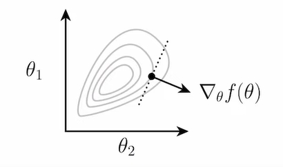
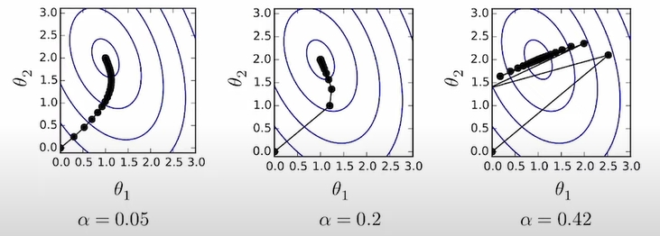

# Lecture 2 - ML Refresher / Softmax Regression
  - 20220908
  - J.Zico Kolter

# reference
- http://rasbt.github.io/mlxtend/user_guide/classifier/SoftmaxRegression/
- http://doraemonzzz.com/2022/10/17/2022-10-17-Deep-Learning-Systems-HW0/#Question-6-Softmax-regression-in-C

# Outline
  - Basics of machine learning
  - Example: softmax regression

# Machine learning as data-driven programming
  - Suppose you want to write a program that will classify handwritten drawing of digits into their appropriate category: 0,1,...,9
  - You could, think hard about the nature of digits, try to determing the logic of what indicates what kind of digit, and write a program to codify this logic
  - Despite being a reasonable coder, I don't think I counld do this very well

# Machine learning as data-driven programming
  - The (supervised) ML approach: colect a training set of images with known labels and feed these into a machine learning algorithm, which will(if done well) automatically product a "program" that solves this task
  - 

# Three ingredients of a machine learning algorithm
  - every machine learning algorithm consists of three different elements:
  - 1. The hypothesis class: the "program structure", parameterized via a set of **parameters**, that describes how we map inputs(e.g., images of digits) to outputs(e.g., class labesl, or probabilities of different class labels)
  - 2. The loss function: a function that specifies how "well" a given hypothesis(i.e., a choice of parameters) performs on the task of interest
  - 3. An optimization method: a procedure for determining a set of parameters that(approximately) minimize the sum of losses over the training set

# Multi-class classification setting
  - Let's consider a k-class classification setting, where we have
    - Training data:
    $$
    \begin{matrix}
    x^{(i)} \in R^n  \\
    y^{(i)} \in \{1,...,k\}  \\
    or i = 1,...,m
    \end{matrix}
    $$
    
    $$
    x^{(i)} = \begin{pmatrix}
    x_1^i \\
    x_2^i \\
    ... \\
    x_n^i \\
    \end{pmatrix}
    $$
    - n = dimensionality of the input data
    - k = number of different classes/labels
    - m = number of points in the trainig set

  - Example: classification of 28x28 MNIST digits
    - n = 28*28 = 784
    - k = 10
    - m = 60,000

# Linear hypothesis function
  - Our hypothesis function maps inputs $$x \in R^n $$ to k-dimensional vectos $$ h:R^n -> R^k $$
    - where $$ h_i^x $$ indicates some measure of "belief" in how much likely the label is to be class i(i.e., "most likely" prediction is coordinate i with largest $$ h_i(x) $$
  - A linear hypothesis function uses a linear operator (i.e. matrix multiplication) for this transformation $$ h_\theta(x) = \theta^Tx $$ for parameters $$\theta \in R^{nxk} $$

  $$
  h(x) = \begin{bmatrix}
  h_1(x) \\
  h_2(x) \\
  ... \\
  h_k(x) \\
  \end{bmatrix}
  $$

  $$ \theta^T[k,n] * x[n,1] =  h_\theta(x)[k,1]$$ 

# Matrix batch notation
  - Often more convenient(and this is how you want to code things for efficency) to write the data and operations in matrix batch form

    $$
    \begin{matrix}
    X \in R^{m \ast n} = \begin{bmatrix}
    {x^{(1)}}^T \\
    {x^{(2)}}^T \\
    ... \\
    {x^{(m)}}^T \\
    \end{bmatrix}
    \end{matrix}
    $$

    $$
    \begin{matrix}
    y \in {\{1,...,k\}}^m = \begin{bmatrix}
    {y^{(1)}} \\
    {y^{(2)}} \\
    ... \\
    {y^{(m)}} \\
    \end{bmatrix}
    \end{matrix}
    $$
  
  - Then the linear hypothesis applied to this batch can be written as
    $$
    h_\theta(X) = \begin{bmatrix}
    {h_\theta(x^{(1)}}^T) \\
    {h_\theta(x^{(2)}}^T) \\
    ... \\
    {h_\theta(x^{(m)}}^T) \\
    \end{bmatrix} = \begin{bmatrix}
    {x^{(1)}}^T\theta \\
    {x^{(2)}}^T\theta \\
    ... \\
    {x^{(m)}}^T\theta \\
    \end{bmatrix} = X\theta
    $$

# Loss function #1: classification error
  - The simplest loss function to use in classification is just the classification error, i.e., whether the classifier makes a mistake a or not
  $$
  l_err(h(x),y) = \left \{ 
  \begin{array}{c}
  0, & if\ argmax_ih_i(x) = y \\ 
  1, & otherwise
  \end{array}
  \right.
  $$

  - we typically use this loss function to access the quality of classifiers
  - Unfortunately, the error is a bad loss function to use for optimization, i.e., selecting the best parameters, because it is not differentiable
  - can not optimize

# Loss function #2: softmax / cross-entripy loss
  - Let's convert the hypothesis function to a "probability" by exponentiating and normalizing its entries(to make them all positive and sum to one)
  $$ z_i = p(label=i) = \frac {exp(h_i(x))}{\sum_{j=1}^kexp(h_j(x))} \Rightarrow z \equiv normalize(exp(h(x))) $$
  $$ softmax(h(x)) = \frac {exp(h_i(x))}{\sum_{j=1}^kexp(h_j(x))} $$
  - Then let's define a loss to be the (negative) log probablity of the true class: this is called softmax or cross-entropy loss
  $$ l_{ce}(h(x),y) = -log_p(label = y) = -h_y(x) + log\sum_{j=1}^kexp(h_j(x))$$

# The softmax regression optimization problem
  - The third ingredient of a machine learning algorithm is a method for solving the associated optimization problem, i.e., the problem of minimizing the average loss on the trainig set
  $$ \min_{\theta} \frac{1}{m}\sum_{j=1}^m l(h_{\theta}(x^{(i)}, y^{(i)}) $$
  - For softmax regression(i.e., linear hypothesis class and softmax loss):
  $$ \min_{\theta} \frac{1}{m}\sum_{i=1}^m l_{ce}(\theta^Tx^{(i)}, y^{(i)}) $$
  - So how do we find $$ \theta $$ that solves this optimization problem?

# Optimization: gradient descent
  - For a matrix-input, scalar output function: 
  $$ f: R^{n \star k} \Rightarrow R $$
  the gradient is defined as the matrix of partial derivatives
  $$ \nabla_{\theta}f(\theta) \in R^{n \star k} = \begin{bmatrix}
  \frac{\alpha f(\theta)}{\alpha \theta_{11}} & ... & \frac{\alpha f(\theta)}{\alpha \theta_{1k}} \\
  & ... \\
  \frac{\alpha f(\theta)}{\alpha \theta_{n1}} & ... & \frac{\alpha f(\theta)}{\alpha \theta_{nk}} \\
  \end{bmatrix}
  $$
  - Gradient points in the direction that most increases f(locally)
  - 
  - The gradient points in the direction of maximal increase
  - To minimize a function, the gradient descent algorithm proceeds by iteratively taking steps in the direction of the negative gradient
  $$ \theta := \theta - \alpha\nabla_{\theta}f(\theta) $$
  where $$ \theta[n,k], \alpha\nabla_{\theta}f(\theta)[n,k], \alpha > 0 $$ is a step size or learning rate
  - 

# Stochastic gradient descent(SGD)
  - If our objective(as is the case in machine learning) is the sum of individual losses, we don't want to compute the gradient using all examples to make a single update to the parameters
  - Instead, take many gradient steps each based upon a minibatch(small partition of the data), to make many parameter update using a single "pass" over data
    - Repeat:
      - Sample a minibatch of data 
      $$ X \in R^{B \star n}, y \in {\{1,...,k\}}^B $$
      - Update parameters 
      $$ \theta := \theta - \frac{\alpha}{B} \sum_{i=1}^B{\nabla_{\theta}l(h_{\theta}(x^{(i)}),y^{(i)})} $$
  - $$ \min_{\theta} \frac{1}{m}\sum_{i=1}^m l(h(x^{(i)}), y^{(i)}) = \sum_{i=1}^n{\nabla_{\theta}l(h(x^{(i)}),y^{(i)})} $$

# The gradient of the softmax objective
  - so, how do we compute the gradient for the software objective?
  $$ \nabla_{\theta}l_{ce}(\theta^{T}x,y) $$
  - Let's start by deriving the gradient of the softmax loss itself: for vector 
  $$ h \in R^k $$
  $$ \frac{\alpha l_{ce}(h,y)}{\alpha h_{i}} = \frac{\alpha}{\alpha h_i}(-h_y + log \sum_{i=1}^{k}exp(h_j) 
  $$
  $$ \frac{\alpha}{\alpha h_i} * -h_y = -1\{i==y\} $$
  $$ \frac{\alpha}{\alpha h_i} * log \sum_{i=1}^{k}exp(h_j) 
  = \frac{\frac{\alpha}{\alpha h_i}(\sum_{j=1}^{k}exp(h_j))}{\sum_{j=1}^{k}exp(h_j)}
  = \frac{exp(h_i)}{\sum_{i=1}^{k}exp(h_j)}
  $$
  - So, in vector form:
  $$ \nabla_{\theta}l_{ce}(h,y) = z - e_y$$
  $$ z = normalize(exp(h)) $$

  - So how we compute the gradient 
  $$ \nabla_{\theta}l_{ce}(\theta^{T}x,y) $$

  - The chain rule of multivariate calculus ... but the dimensions of all the matrices and vectors get pretty cumbersome
  - Approach #1 (a.k.a. the right way): use matrix differential calculus, Jacobians, Kronecker products, and vectorization
  - Approach #2 (a.k.a. the hacky quick way that everyone actually does): Pretend everythin is a scalar, use the typical chain rule, and then rearrange / transpose matrices/vectors to make the sizes work (and check your answer numerically)

# The slide I'm envarrassed to include...
  - Let's compute the "derivative" of the loss:
  $$ \frac{\alpha}{\alpha\theta}l_{ce}(\theta^{T}x,y) $$
  $$ = \frac{\alpha l_{ce}(\theta^Tx,y)}{\alpha\theta^Tx} * \frac{\alpha \theta^T x}{\theta} $$
  $$ = (z-e_y)*x $$

  $$ z = normalize(exp(\theta^T x)) $$
  $$ (z-e_y)[K,1], x[n,1] $$

  - So to make the dimensions work...
  $$ \nabla_{\theta}l_{ce}(\theta^{T}x,y) \in R^{n * k} = x(z-e_y)^T $$
  - Same process works if we use "matrix batch" form of the loss
  $$ \nabla_{\theta}l_{ce}(X\theta,y) \in R^{n * k} = X^T(Z - I_y) $$

  $$ \frac{\alpha}{\alpha\theta}l_{ce}(X\theta,y) 
  = \frac{\alpha l_{ce}(X\theta,y)}{\alpha X\theta} * \frac{\alpha X\theta}{\alpha \theta} 
  = \frac{\alpha X\theta}{(Z-I_y)}
  $$
  $$ z = normalize(exp(X\theta i)) by row $$ 
  (Z-I_y)[m,k]; X[m,k]

# Puttin it all together
  - Despite a fairly complex derivation, we should highly just how simple the final algorithm is
    - Repeat until parameters / loss converges
    - 1. Iterate over minibatches
      
      $$ X \in R^{R*n}, y \in ({1,...,k})^T $$
      of training set
    - 2. Update the parameters
    $$ \theta := \theta - \frac{\alpha}{B}X^T(Z-I_y) $$
  - That is the entirety of the softmax regression algorithm
  - As you will see on the homework, this gets less than 8% error in classifying MNIST digits, runs in a couple seconds
  - Up next time: neural networks (a.k.a. fancier hypothesis classes)

# hw0
- hw0/src/simple_ml.py

## Question 3: Softmax loss

- Implement the softmax (a.k.a. cross-entropy) loss as defined in `softmax_loss()` function in `src/simple_ml.py`.  Recall (hopefully this is review, but we'll also cover it in lecture on 9/1), that for a multi-class output that can take on values $y \in \{1,\ldots,k\}$, the softmax loss takes as input a vector of logits $z \in \mathbb{R}^k$, the true class $y \in \{1,\ldots,k\}$ returns a loss defined by
- $$
    \begin{equation}
    \ell_{\mathrm{softmax}}(z, y) = \log\sum_{i=1}^k \exp (z_i) - z_y.
    \end{equation}
  $$

- Note that as described in its docstring, `softmax_loss()` takes a _2D array_ of logits (i.e., the $k$ dimensional logits for a batch of different samples), plus a corresponding 1D array of true labels, and should output the _average_ softmax loss over the entire batch.  Note that to do this correctly, you should _not_ use any loops, but do all the computation natively with numpy vectorized operations (to set expectations here, we should note for instance that our reference solution consists of a single line of code).

- Note that for "real" implementation of softmax loss you would want to scale the logits to prevent numerical overflow, but we won't worry about that here (the rest of the assignment will work fine even if you don't worry about this).  The code below runs the test cases.

## Question 4: Stochastic gradient descent for softmax regression

- In this question you will implement stochastic gradient descent (SGD) for (linear) softmax regression.  In other words, as discussed in lecture on 9/1, we will consider a hypothesis function that makes $n$-dimensional inputs to $k$-dimensional logits via the function
- $$
    \begin{equation}
    h(x) = \Theta^T x
    \end{equation}
  $$
- where $x \in \mathbb{R}^n$ is the input, and $\Theta \in \mathbb{R}^{n \times k}$ are the model parameters.  Given a dataset $\{(x^{(i)} \in \mathbb{R}^n, y^{(i)} \in \{1,\ldots,k\})\}$, for $i=1,\ldots,m$, the optimization problem associated with softmax regression is thus given by
- $$ \min_{\theta} \frac{1}{m} \sum_{i=1}^m \ell_{\mathrm{softmax}}(\Theta^T x^{(i)}, y^{(i)}) $$
- Recall from class that the gradient of the linear softmax objective is given by
- $$
  \begin{equation}
  \nabla_\Theta \ell_{\mathrm{softmax}}(\Theta^T x, y) = x (z - e_y)^T
  \end{equation}
  $$
- where
- $$
  \begin{equation}
  z = \frac{\exp(\Theta^T x)}{1^T \exp(\Theta^T x)} \equiv normalize(\exp(\Theta^T x))
  \end{equation}
  $$
- (i.e., $z$ is just the normalized softmax probabilities), and where $e_y$ denotes the $y$th unit basis, i.e., a vector of all zeros with a one in the $y$th position.

- We can also write this in the more compact notation we discussed in class.  Namely, if we let $X \in \mathbb{R}^{m \times n}$ denote a design matrix of some $m$ inputs (either the entire dataset or a minibatch), $y \in \{1,\ldots,k\}^m$ a corresponding vector of labels, and overloading $\ell_{\mathrm{softmax}}$ to refer to the average softmax loss, then
- $$
  \begin{equation}
  \nabla_\Theta \ell_{\mathrm{softmax}}(X \Theta, y) = \frac{1}{m} X^T (Z - I_y)
  \end{equation}
  $$
- where
- $$
  \begin{equation}
  Z = normalize(\exp(X \Theta)) (normalization \ applied \ rowwise)
  \end{equation}
  $$
- denotes the matrix of logits, and $I_y \in \mathbb{R}^{m \times k}$ represents a concatenation of one-hot bases for the labels in $y$.

- Using these gradients, implement the `softmax_regression_epoch()` function, which runs a single epoch of SGD (one pass over a data set) using the specified learning rate / step size `lr` and minibatch size `batch`.  As described in the docstring, your function should modify the `Theta` array in-place.  After implementation, run the tests.
- step
  - y = label
  - $ I_y $: apply one-hot encoding to encode the class labels into a format that we can more easily work with
  - predict_value = Z = softmax(X@theta)
  - $ loss = Z - I_y $
  - b = batch size of X
  - $ gradient = \nabla l_{softmax}(X, y) = \frac1b X^T loss $
  - update
    - $ \theta = \theta - learning_rate * gradient $

## Question 5: SGD for a two-layer neural network

- Now that you've written SGD for a linear classifier, let's consider the case of a simple two-layer neural network.  Specifically, for input $x \in \mathbb{R}^n$, we'll consider a two-layer neural network (without bias terms) of the form
- $$
  \begin{equation}
  z = W_2^T \mathrm{ReLU}(W_1^T x)
  \end{equation}
  $$
- $$
  \begin{equation}
  z = \mathrm{ReLU}(xW_1) W_2
  \end{equation}
  $$
- where $W_1 \in \mathbb{R}^{n \times d}$ and $W_2 \in \mathbb{R}^{d \times k}$ represent the weights of the network (which has a $d$-dimensional hidden unit), and where $z \in \mathbb{R}^k$ represents the logits output by the network.  We again use the softmax / cross-entropy loss, meaning that we want to solve the optimization problem
- $$
  \begin{equation}
  minimize_{W_1, W_2} \;\; \frac{1}{m} \sum_{i=1}^m \ell_{\mathrm{softmax}}(W_2^T \mathrm{ReLU}(W_1^T x^{(i)}), y^{(i)}).
  \end{equation}
  $$
- Or alternatively, overloading the notation to describe the batch form with matrix $X \in \mathbb{R}^{m \times n}$, this can also be written
- $$ 
  \begin{equation}
  minimize_{W_1, W_2} \;\; \ell_{\mathrm{softmax}}(\mathrm{ReLU}(X W_1) W_2, y).
  \end{equation}
  $$
- Using the chain rule, we can derive the backpropagation updates for this network (we'll briefly cover these in class, on 9/8, but also provide the final form here for ease of implementation).  Specifically, let
- $$
  \begin{equation}
  \begin{split}
  Z_1 \in \mathbb{R}^{m \times d} & = \mathrm{ReLU}(X W_1) \\
  G_2 \in \mathbb{R}^{m \times k} & = normalize(\exp(Z_1 W_2)) - I_y \\
  G_1 \in \mathbb{R}^{m \times d} & = \mathrm{1}\{Z_1 > 0\} \circ (G_2 W_2^T)
  \end{split}
  \end{equation}
  $$
- where $\mathrm{1}\{Z_1 > 0\}$ is a binary matrix with entries equal to zero or one depending on whether each term in $Z_1$ is strictly positive and where $\circ$ denotes elementwise multiplication.  Then the gradients of the objective are given by
- $$
  \begin{equation}
  \begin{split}
  \nabla_{W_1} \ell_{\mathrm{softmax}}(\mathrm{ReLU}(X W_1) W_2, y) & = \frac{1}{m} X^T G_1  \\
  \nabla_{W_2} \ell_{\mathrm{softmax}}(\mathrm{ReLU}(X W_1) W_2, y) & = \frac{1}{m} Z_1^T G_2.  \\
  \end{split}
  \end{equation}
  $$
- **Note:** If the details of these precise equations seem a bit cryptic to you (prior to the 9/8 lecture), don't worry too much.  These _are_ just the standard backpropagation equations for a two-layer ReLU network: the $Z_1$ term just computes the "forward" pass while the $G_2$ and $G_1$ terms denote the backward pass.  But the precise form of the updates can vary depending upon the notation you've used for neural networks, the precise ways you formulate the losses, if you've derived these previously in matrix form, etc.  If the notation seems like it might be familiar from when you've seen deep networks in the past, and makes more sense after the 9/8 lecture, that is more than sufficient in terms of background (after all, the whole _point_ of deep learning systems, to some extent, is that we don't need to bother with these manual calculations).  But if these entire concepts are _completely_ foreign to you, then it may be better to take a separate course on ML and neural networks prior to this course, or at least be aware that there will be substantial catch-up work to do for the course.

- Using these gradients, now write the `nn_epoch()` function in the `src/simple_ml.py` file.  As with the previous question, your solution should modify the `W1` and `W2` arrays in place.  After implementing the function, run the following test.  Be sure to use matrix operations as indicated by the expresssions above to implement the function: this will be _much_ faster, and more efficient, than attempting to use loops (and it requires far less code).
- step
  - y = label
  - $ I_y $: apply one-hot encoding to encode the class labels into a format that we can more easily work with
  - $ Z1 = relu(X@W_1) $ 
  - $ Z2 = relu(Z1@W_2) $ 
  - $ predict = softmax(Z2) $ 
  - $ G2 = predict - I_y $
  - $ G1 = \mathrm{1}\{Z_1 > 0\} \circ G2@W_2.T $
  - b = batch size of X
  - $ W2_grad = \nabla w_1 l_{softmax}(relu(X@W_1)W_2, y) = \frac1b Z1^T G2 $
  - $ W1_grad = \nabla w_2 l_{softmax}(relu(X@W_1)W_2, y) = \frac1b X^T G1 $
  - update
    - $ W_2 = W_2 - learning_rate * grad_2 $
    - $ W_1 = W_1 - learning_rate * grad_1 $
