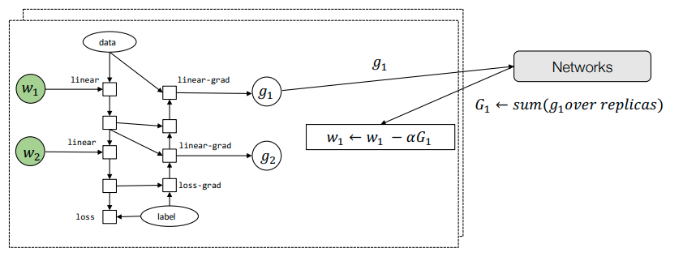

# Outline
- Techniques for memory saving
- Parallel and distributed training

# Techniques for memory saving
- Model
- Data
- Compute

# Elements of machine learning systems
- Bigger dataset requires larger model capacity. Which in turn puts demands on computing devices. The success of machine learning is a combination of all the three elements. Many recent advances requires us to push all three to their limits.
- Today we will study two topics:
  - How to reduce the memory consumption, so we can fit bigger models into a single device.
  - How to scale up the training process

# Recap: GPU memory hierarchy
```
            block0                   ...    block3
-thread0- -thread1- ... -thread8-
registers registers      registers

----------shared_memory----------

--------------------global_memory--------------------
``` 
- Shared memory: 64 KB per core
  - core = block0 ???
- GPU memory(Global memory)
  - RTX3080 10GB
  - RTX3090 24GB
  - A100 40/80 GB
- problem: reduce the overall activation memory cost
  - reuse
  - time replace memory

# Sources of memory consumption
- A simplified view of a typical computational graph for training, weights are omitted and implied in the grad steps.
  ```
  input -> linear -> relu -> linear -> loss
   \        \         \       \         \\
    lg <--- rg  <---  lg <---  lsg <--- label 
  ```
  - lg = linear_grad
  - rg = relu_grad
  - lsg = loss_grad
- Sources of memory consumption
  - Model weights
    - w1
    - w2 
  - Optimizer states
    - u1
    - u2
  - Intermediate activation values
    - linear
    - relu
    - linear

# Techniques for memory saving inference only
- input -> linear -> relu -> linear -> loss
- We only need O(1) memory for computing the final output of a N layer deep network by cycling through two buffers

# Activation memory cost for training
  ```
  input -> linear -> relu -> linear -> loss
   \        \         \       \        /\\
   \\/      \\/       \\/     \\/        \
     lg <--- rg  <---  lg <---  lsg <--- label 
  ```
- Because the need to keep intermediate value around (checkpoint) for the gradient steps. Training a N-layer neural network would require O(N) memory. 
  - ping-pong recycling to do memory reuse
- We will use the following simplified view to combine gradient and forward computation 
  - 2 <-> 2 <-> 2 <-> 2 <-> 2 <-> 2
    - 2:red
    - 1:white

# Checkpointing techniques in AD

- step0
  - 1 --> 2 --> 1 --> 2 --> 1 --> 2
    - forward computation
    - get value of 2, delete value of 1
    - 1: empty boxes. as soon as I compute a result and I compute next value that depends on a result, I'm going to deallocate the memory on those empty boxes.
    - 2: checkpoint. store the reult in checkpoint node, they can remember the result of this corresponding stages.

- step1
  -                   1 <-> 1 <-> 1
    - adjoint value
    - recompute the value of 1
    - run again, another tiny forward computation
    - calculate and fill in the adjoint value in the empty box(1)

- step2
  -       2 <-> 2 <-> 2
  - gradient computation
  - compute all weight update
  - run the gradient computation and obtain adjoint value of each layers

- Only checkpoint colored nodes (step 0)
- Recompute the missing intermediate nodes in small segments (step 1, 2)

# Sublinear memory cost algorithm
- widely used

- why save memory?
  - s0: remember 2 only, save memory with 1 type

- Forward computation
  - 1 --> 2 --> 1 --> 2 --> 1 --> 2
  - checkpoint cost = N/K

- Gradient per segment with re-computation
  -                   2 <-> 2 <-> 2
  -       2 <-> 2 <-> 2
  - re-computation cost = K

- For a N layer neural network, if we checkpoint every K layers
  - $ Memory\ cost = O(\frac{N}{K}) + O(K), K=\sqrt N $
  - Checkpoint cost
  - Re-computation cost
  - get a sublinear memory cost with respect to the total number of layers

- total computation
  - before = forward + gradient = s0 + g + g = 2.5g
  - after = forward + recompute + gradient + recompute + adjoint = s0 + s0 + g + s0 + d = 3s0 + 2g = 3.5g
  - s0 forward computation is about half of the gradient computations, s0 = 0.5g
  - increase 20-25% additional computation costs
    - 2.5/3.5 = 0.71

- re-materialization technique
  - different layer have differnt recompute cost, conv/dense are heavily computational cost layers, so we can choose to only recompute those cheap layers
  - more eddicient trainig process


# Parallel and distributed training
- Leverage multiple (GPU) devices that are possibly distributed over several worker nodes to train a model.

# Model parallel training
- Maps parts of the computation graph to workers 
  ```
            /|\    /|\    /|\
  worker0    2 ->   3 ->   4
            /|\    /|\    /|\
  worker1    1 ->   2 ->   3
            /|\    /|\    /|\
  worker2    0  ->  1 ->   2
            /|\    /|\    /|\
  ```
  - each worker can correspond to a single CPU
  - sequence dimension
  - depth dimension
  - parallel in wave-front fashion \

# Breaking up the computation for model parallelism
- model parallelism
- partition it across different workers
- insert send and receive pairs
```
worker0                            worker1
                   | 
    GPU <---  GPU< | -GPU <-- GPU <- label
   /          /|\  |/        /|\       |
  /            |  /|          |       \|/
data -> GPU -> GPU |-> GPU -> GPU ->  GPU
                   |
```
- Partition the graph, put send/recv pairs in the boundary
```
worker0                            worker1
                         | 
    GPU <---  GPU<- recv | send <-GPU <-- GPU <- label
   /          /|\        |       / /|\       |
  /            |         |      /   |       \|/
data -> GPU -> GPU->send |  recv ->GPU -> GPU ->  GPU
                         |
```
  - 0: worker0: micro-batches0
  - 1: worker0: micro-batches1, worker1: micro-batches0
  - 2: worker0: micro-batches2, worker1: micro-batches1
  - ....
  - keep this pipeline busy

# Data parallel training

- Loss function
  - $ \theta := \theta - \frac{a}{B} \sum_{i=1}^{B} \nabla_{\theta}l(h_{\theta}(x^{(i)}),y^{(i)}) $
  - stochastic gradient descent
- Let each worker access $\frac{B}{K}$ fraction of the minibatch, and run gradient computation then sum up all gradients together
  - computed independently
  - divide that mini-batches onto a lot of smaller batches
  - distribute that fraction of mini-batch onto each worker
  - within each worker, we're going to run the gradient computations in parallel and then sum the gradient together
- Every worker runs the same replica of the model

# Allreduce abstraction
- Interface 
  - result = allreduce(float buffer[size])
- Running Example
  - Worker 0
  ```
  comm = communicator.create()
  a = [1, 2, 3]
  b = comm.allreduce(a, op=sum)
  assert b == [2, 2, 4]
  ```
  - Worker 1
  ```
  comm = communicator.create()
  a = [1, 0, 1]
  b = comm.allreduce(a, op=sum)
  assert b == [2, 2, 4]
  ```
  - each worker have a local copy of array
  - they can all go ahead and collectively call reduce
    - 1+1=2, 2+0=2, 3+1=4
- allreduce is kind of quite intuitive in some sense 
- NCCL: NVIDIA collective library that implemenmts or reduce along with other primitives
- Horovod
- ByteDancePS

# Data parallel training via allreduce
- Many replicas of the same graph run in parallel

  - run on different workers
  - run exactly the same replica, feed in a differnt set of datas
  - need to compute the sum of gradient over all the replicas: G1=sum(g1 over replicas)
  - w1 = w1 - aG1, each worker is going to apply the gradient update locally on them
- don't need to change any lines of code

# Parameter server abstraction
- Interface
  - ps.push(index, gradient)
  - ps.pull(index)
- directly send a gradient value to the parameter server
- Performs weight update on the server(key value store)
  - parameter server: get gradient value on the server side and run weight updates there, then send the weight back

# Data parallel training via parameter server
- Many replicas of the same graph run in parallel
- Update result on remote server and send updated results back
- advantages of parameter server
  - more robust training process if you want to have a more advanced strategy
    - 100 workers, obtain 99 gradient, don't need to wait the last workers gradient(too slow)
    - some worker dies and restarted on another server node
- BYtePS from ByteDance

# Communication computation overlap
- Many opportunities to continue computation while sending data over the network

  - overlap communication with computation
  - system lavel

# Parallelization summary
- Model parallel training partition by parts in the computational graph.
- Data parallel training partition by data.
- In all cases, leverage the opportunities to overlap compute with communication.

# Advanced parallelization methods
- There are more ways to parallelize a computational graph.
- Some optional reference readings:
  - ZeRO: Memory Optimizations Toward Training Trillion Parameter Models.
  - Beyond Data and Model Parallelism for Deep Neural Networks.
  - GSPMD: General and Scalable Parallelization for ML Computation Graphs