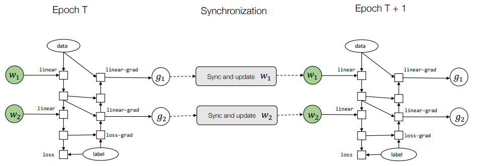

# Outline
- Techniques for memory saving
- Parallel and distributed training

# Techniques for memory saving
- Model
- Data
- Compute

# Elements of machine learning systems
- Bigger dataset requires larger model capacity. Which in turn puts demands on computing devices. The success of machine learning is a combination of all the three elements. Many recent advances requires us to push all three to their limits.
- Today we will study two topics:
  - How to reduce the memory consumption, so we can fit bigger models into a single device.
  - How to scale up the training process

# Recap: GPU memory hierarchy
```
            block0                   ...    block3
-thread0- -thread1- ... -thread8-
registers registers      registers

----------shared_memory----------

--------------------global_memory--------------------
``` 
- Shared memory: 64 KB per core
  - core = block0 ???
- GPU memory(Global memory)
  - RTX3080 10GB
  - RTX3090 24GB
  - A100 40/80 GB

# Sources of memory consumption
- A simplified view of a typical computational graph for training, weights are omitted and implied in the grad steps.
  ```
  input -> linear -> relu -> linear -> loss
   \        \         \       \         \\
    lg <--- rg  <---  lg <---  lsg <--- label 
  ```
  - lg = linear_grad
  - rg = relu_grad
  - lsg = loss_grad
- Sources of memory consumption
  - Model weights
    - w1
    - w2 
  - Optimizer states
    - u1
    - u2
  - Intermediate activation values
    - linear
    - relu
    - linear

# Techniques for memory saving inference only
- input -> linear -> relu -> linear -> loss
- We only need O(1) memory for computing the final output of a N layer deep network by cycling through two buffers

# Activation memory cost for training
- Because the need to keep intermediate value around (checkpoint) for the gradient steps. Training a N-layer neural network would require O(N) memory. 
- We will use the following simplified view to combine gradient and forward computation 
  - 2 <-> 2 <-> 2 <-> 2 <-> 2 <-> 2
    - 2:red
    - 1:white

# Checkpointing techniques in AD
- step0
  - 1 <-> 2 <-> 1 <-> 2 <-> 1 <-> 2
- step1
  -                   2 <-> 2 <-> 2
- step2
  -       2 <-> 2 <-> 2

- Only checkpoint colored nodes (step 0)
- Recompute the missing intermediate nodes in small segments (step 1, 2)

# Sublinear memory cost
- Forward computation
  - 1 <-> 2 <-> 1 <-> 2 <-> 1 <-> 2
- Gradient per segment with re-computation
  -                   2 <-> 2 <-> 2
  -       2 <-> 2 <-> 2
- For a N layer neural network, if we checkpoint every K layers
  - $ Memory\ cost = O(\frac{N}{K}) + O(K), K=\sqrt N $
  - Checkpoint cost
  - Re-computation cost

# Parallel and distributed training
- Leverage multiple (GPU) devices that are possibly distributed over several worker nodes to train a model.

# Model parallel training
- Maps parts of the computation graph to workers 
  ```
            /|\    /|\    /|\
  worker0   GPU -> GPU -> GPU
            /|\    /|\    /|\
  worker1   GPU -> GPU -> GPU
            /|\    /|\    /|\
  worker2   GPU -> GPU -> GPU
            /|\    /|\    /|\
  ```

# Breaking up the computation for model parallelism
- split
```
worker0                            worker1
                   | 
    GPU <---  GPU< | -GPU <-- GPU <- label
   /          /|\  |/        /|\       |
  /            |  /|          |       \|/
data -> GPU -> GPU |-> GPU -> GPU ->  GPU
                   |
```
- Partition the graph, put send/recv pairs in the boundary
```
worker0                            worker1
                         | 
    GPU <---  GPU<- recv | send <-GPU <-- GPU <- label
   /          /|\        |       / /|\       |
  /            |         |      /   |       \|/
data -> GPU -> GPU->send |  recv ->GPU -> GPU ->  GPU
                         |
```
# Data parallel training
- Loss function
- $ \theta := \theta - \frac{a}{B} \sum_{i=1}^{B} \nabla_{\theta}l(h_{\theta}(x^{(i)}),y^{(i)}) $
- Let each worker access $\frac{B}{K}$ fraction of the minibatch, and run gradient computation then sum up all gradients together
- Every worker runs the same replica of the model

# Allreduce abstraction
- Interface 
  - result = allreduce(float buffer[size])
- Running Example
  - Worker 0
  ```
  comm = communicator.create()
  a = [1, 2, 3]
  b = comm.allreduce(a, op=sum)
  assert b == [2, 2, 4]
  ```
  - Worker 1
  ```
  comm = communicator.create()
  a = [1, 0, 1]
  b = comm.allreduce(a, op=sum)
  assert b == [2, 2, 4]
  ```

# Data parallel training via allreduce
- Many replicas of the same graph run in parallel


# Parameter server abstraction
- Interface
  - ps.push(index, gradient)
  - ps.pull(index)
- Performs weight update on the server(key value store)

# Data parallel training via parameter server
- Many replicas of the same graph run in parallel
- Update result on remote server and send updated results back

# Communication computation overlap
- Many opportunities to continue computation while sending data over the network


# Parallelization summary
- Model parallel training partition by parts in the computational graph.
- Data parallel training partition by data.
- In all cases, leverage the opportunities to overlap compute with communication.

# Advanced parallelization methods
- There are more ways to parallelize a computational graph.
- Some optional reference readings:
  - ZeRO: Memory Optimizations Toward Training Trillion Parameter Models.
  - Beyond Data and Model Parallelism for Deep Neural Networks.
  - GSPMD: General and Scalable Parallelization for ML Computation Graphs