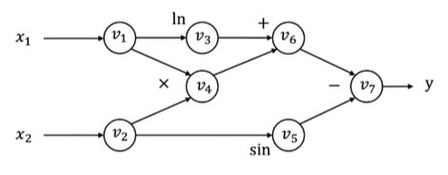
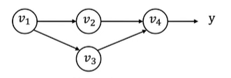

automatic differentiation
# outline
- general introduction to different differentiation methods
- reverse mode automatic differentiation

# how does differentiation fit into machine learning

- recap: every machine learning algorithm consists of **three** different elements. computing the loss function gradient with respect to hypothesis class parameters is the most common operation in machine learning
- the hypothesis class
  $$ x -> module -> h_{\theta}(x) $$
  - a set of parameter theta
  - learn theta from training datas
- the loss function
  $$ l(h_\theta(x),y) = -h_y(x) + log\sum_{i=1}^k exp(h_j(x)) $$
  - measure how good we prediction is
- an optimization mehod
  $$ \theta := \theta - \frac{a}{b}\sum_{i=1}^B\nabla_{\theta}l(h_{\theta}(x^i),y^i) $$ 
  - find good theta to minimize the loss function

# numerical differentiation
- directly compute the partial gradient by defintion
  $$ \frac{\partial f(\theta)}{\partial \theta_i} = \lim_{\epsilon->0} \frac{f(\theta + \epsilon e_i)-f(\theta)}{\epsilon} $$
  - f is the loss function
    $$ \nabla f(\theta) =
    \begin{bmatrix}
    \partial_{\theta 0} f(\theta) \\
    \partial_{\theta 1} f(\theta) \\
    ...\\
    \partial_{\theta n} f(\theta) \\
    \end{bmatrix}
    $$
  - ei is a unidirectional vector, 0 everywhere and 1 in ith element place
    $$ \epsilon_i =
    \begin{bmatrix}
    0 \\
    0 \\
    ...\\
    1 \\
    0 \\
    0 \\
    \end{bmatrix}
    $$
- a more numerically accurate way to approximate the gradient
  $$ \frac{\partial f(\theta)}{\partial \theta_i} = \frac{f(\theta + \epsilon e_i)-f(\theta - \epsilon e_i)}{2\epsilon} + O(\epsilon^2) $$

  $$ f(\theta + \delta) = f(\theta) + f'(\theta)\delta + \frac12f''(\theta)\delta^2 + O(\delta^3) $$
- suffer from numerical error less efficient to compute
  - need epsilon to be small

# Numerical gradient checking
- however, numerical differentiation is a powerful tool to check an implement of an automatic differentiation algorithm in unit test cases
  $$ \delta^T\nabla_\theta f(\theta) = \frac{f(\theta + \epsilon \delta)-f(\theta - \epsilon \delta)}{2\epsilon} + O(\epsilon^2) $$
  - delta vector
  - random pick delta from unit ball, check the above invariance

# Symbolic differentiationn
- write down the formulas, derive the gradient by sum, product and chain rules
  - gradient of sum of two functions
    $$ \frac{\partial(f(\theta)+g(\theta))}{\partial \theta} = \frac{\partial f(\theta)}{\partial \theta} + \frac{\partial g(\theta)}{\partial \theta} $$
  - gradient of multiplications of two functions
    $$ \frac{\partial(f(\theta) * g(\theta))}{\partial \theta} = g(\theta)\frac{\partial f(\theta)}{\partial \theta} + f(\theta)\frac{\partial g(\theta)}{\partial \theta} $$
  - gradient of compose function
    $$ \frac{\partial f(g(\theta))}{\partial \theta} = \frac{\partial f(g(\theta))}{\partial g(\theta)} * \frac{\partial g(\theta)}{\partial \theta} $$

- naively do so can result in wasted computations
  - example
    $$ f(\theta) = \prod_{i=1}^n \theta_i = \theta_1 * \theta_2 * ... * \theta_n $$

    $$ \frac{f(\theta)}{\partial \theta_k} = \prod_{j \ne k}^n \theta_j $$
    $$ \frac{f(\theta)}{\partial \theta_2} = \theta_1 * \theta_3 * ... * \theta_n $$

- Cost n(n-2) multiplies to compute all partial gradients
  - reuse intermediate mmultiplication result

# computational graph

- directed acyclic graph(DAG) 
  $$ y = f(x_1,x_@) = ln(x_1) +x_1x_2 - sin(x_2) $$
- Each node represent an(intermediate) vaule in the computation. Edges present input output relations.
- Forwar evaluation trace vased on topologic order
  $$ v_1 = x_1 = 2 $$
  $$ v_2 = x_2 = 5 $$
  $$ v_3 = ln v_1 = ln_2 = 0.693 $$
  $$ v_4 = v_1 * v_2 = 10 $$
  $$ v_5 - sin(v_2) = sin(5) = -0.959 $$
  $$ v_6 = v_3 + v_4 = 10.693 $$
  $$ v_7 = v_6 - v_5 = 10.693 + 0.959 = 11.652 $$
  $$ y = v_7 = 11.652 $$

# forward mode automatic differentiation(AD)
- Define
  $$ \dot v_i = \frac{\partial v_i}{\partial x_1} $$
- We can then compute the vi iteratively in the forward topological order of the cimputational graph
- Forward AD trace
  $$ \dot v_1 = 1 $$
  $$ \dot v_2 = 0 $$
  $$ \dot v_3 = \frac{\dot v_1}{v_1} = 0.5 $$
  $$ \dot v_4 = (v2*\dot v1) +(v1*\dot v2) = 5*1 + 2*0 = 5 $$
  $$ \dot v_5 = \dot v_2*cos(v_2) = 0*cos(5) = 0 $$
  $$ \dot v_6 = \dot v_3 + \dot v_4 = 0.5 + 5 = 5.5 $$
  $$ \dot v_7 = \dot v_6 - \dot v_5 = 5.5 - 0 = 5.5 $$
- Now we have
  $$ \frac{\partial y}{\partial x_1} = \dot v_7 =5.5 $$ 

# limitation of forward mode AD
- for f:R^n -> R^k, we need n forward AD passes to get the gradient with respect to each input
  - n inputs
  - k outputs
  - good at n is small and k is large
- we mostly care about the cased where k=1 and large n
  - lare inputs and small output
- In order to resolve the problem efficiently, we need to use another kind of AD

# Reverse mode automatic differentiation(AD)
- Define adjoint
  $$ \overline v_i = \frac{\partial y}{\partial v_i} $$
- We can then compute the vi iteratively in the reverse topological order of the comptational graph
- Reverse AD evaluation trace
  $$ \overline v_7 = \frac{\partial y}{\partial v_7} = 1 $$

  $$ \overline v_6 = \frac{\partial y}{\partial v_7}*\frac{\partial v_7}{\partial v_6}  = \overline v_7\frac{\partial v_7}{\partial v_6} = \overline v_7*1 = 1 $$
  
  $$ \overline v_5 = \frac{\partial y}{\partial v_7}*\frac{\partial v_7}{\partial v_5} = \overline v_7\frac{\partial v_7}{\partial v_5} = \overline v_7*(-1) = -1 $$
  
  $$ \overline v_4 = \frac{\partial y}{\partial v_6}*\frac{\partial v_6}{\partial v_4} = \overline v_6\frac{\partial v_6}{\partial v_4} = \overline v_6*1 = 1 $$
  
  $$ \overline v_3 = \frac{\partial y}{\partial v_6}*\frac{\partial v_6}{\partial v_3} = \overline v_6\frac{\partial v_6}{\partial v_3} = \overline v_6*1 = 1 $$
  
  $$ \overline v_2 = \frac{\partial y}{\partial v_5}*\frac{\partial v_5}{\partial v_2} + \frac{\partial y}{\partial v_4}*\frac{\partial v_4}{\partial v_2} = \overline v_5\frac{\partial v_5}{\partial v_2} + \overline v_4\frac{\partial v_4}{\partial v_2} = \overline v_5*cos(v_2) + \overline v_4*v_1 = -1*(cos(5)) + 1*2 = -0.284 + 2 = 1.716 $$
  
  $$ \overline v_1 = \frac{\partial y}{\partial v_4}*\frac{\partial v_4}{\partial v_1} +  = \frac{\partial y}{\partial v_3}*\frac{\partial v_3}{\partial v_1} = \overline v_4\frac{\partial v_4}{\partial v_1} + \overline v_3\frac{\partial v_3}{\partial v_1} = \overline v_4*v_2 + \overline v_3*\frac{1}{v_1} = 1*5 + 1*\frac12 = 5.5 $$
- v2 & v1 have 2 consumers
- from single output and revert all node

# derivation for the multiple pathway case
)
- v1 is being used in **multiple** pathways (v2 and v3)
  - so there have two derivations respect from v2 and v3
- y can be written in the form of y = f(v2,v3)
  $$ \overline v_1 
  = \frac{\partial y}{\partial v_1} = \frac{\partial f(v_2,v_3)}{\partial v_2} \frac{\partial v_2}{\partial v_1} + \frac{\partial f(v_2,v_3)}{\partial v_3} \frac{\partial v_3}{\partial v_1}
  = \overline v_2 \frac{\partial v_2}{\partial v_1} + \overline v_3 \frac{\partial v_3}{\partial v_1} $$
- Define partial adjoint
  $$ \overline {v_{i->j}} = \overline v_j \frac{\partial v_j}{\partial v_i} $$
  for each input output node pair i and j
    $$ \overline v_i = \sum_{j \in next(i)} \overline {v_{i->j}} $$
- We can compute partial adjoints separately then sum them together

# Reverse AD algorithm


- create a dictionary that maps each of the computational graph node to a list of partial adjoint
- sum up partial adjoints and get the adjoint value of v_i
- compute partial adjoints for each of the inputs i

```python
def gradient(out):
  # dictionary that records a list of partial adjoints of each node
  node_to_grad = {out:[1]}
  for i in reverse_topo_order(out):
    # sum up partial adjoints
    vi = sum{j}{v(i->j)} = sum(node_to_grad[i])
    for k in inputs(i):
      compute(v(k->i)) = vi({\patial vi}{\partial vk})
      # propagates partisl adjoint to its input
      append(v(k->i)) to node_to_grad[k]
  return adjoint of input v(input)
```

# reverse mode AD by extending computational graph


- (exp(v1)+1)*exp(v1)
- 1. compute the adjoint value of v_4
- 2. all inputs of v_4
  - v_2, compute partial adjoint
    - v4=v2*v3
    $$ \overline {v_{2->4}} = \overline v_4 \frac{\partial v_4}{\partial v_2} = \overline v_4 * V_3 $$
  - v_3, compute partial adjoint
    $$ \overline {v_3} = \overline v_4 \frac{\partial v_4}{\partial v_3} = \overline v_4 * V_2 $$
- 3. i=3
  $$ \overline {v_{2->3}} = \overline v_3 \frac{\partial v_3}{\partial v_2} = \overline v_3 * 1 = \overline v_3 $$
- 4. i=2
  $$ \overline v_2 = \overline {v_{2->3}} + \overline {v_{2->4}} $$
- 5. i = 1
  - $$ \overline {v_{1->2}} = \overline {v_2} \frac{\partial v_2}{\partial v_1} = \overline {v_2} * exp(v_1) = \overline {v_2} * v_2 $$
- Our previous examples compute adjoint values directly by hand. How can we construct a computational graph that calculates the adjoint values?

# reverse mode AD vs Backprop
- Backprop


  - run backward operations the same forward graph
  - used in first generation deep learning frameworks (caffe, cuda-convnet)

- reverse mode AD by extending computational graph


  - construct separate graph nodes for adjoint
    - new extra gradient part of computation
  - used by modern deep learning frameworks like tf and pytorch

- why
  - two graph can get the gradient of gradient value
  - do optimizations for gradient computation

# reverse mode AD on tensors

- forward evaluation trace
  $$ Z_{ij} = \sum_kX_{ik}W_{kj} $$
  $$ v=f(Z) $$

- forward matrix form
  Z = XW
  v = f(Z)
- define adjoint for tensor values
  $$ \overline Z = 
  \begin{bmatrix}
  \frac{\partial y}{\partial z_{1,1}} & ... & \frac{\partial y}{\partial z_{1,n}} \\
  ... & ... & ... \\ 
  \frac{\partial y}{\partial z_{m,1}} & ... & \frac{\partial y}{\partial z_{m,n}} \\ 
  \end{bmatrix}
  $$
- reverse evaluation in scalar form
  $$ \overline X_{i,k} = \sum_j \frac{\partial Z_{i,j}}{\partial X_{i,k}} = \sum_j W_{k,j}\overline Z_{i,j} $$
- reverse matrix form
  $$ \overline X = \overline Z W^T $$

# discussions
- what are the pros/cons of backprop and reverse mode AD

# handling gradient of gradient
- the result of reverse mode AD is still a computational graph
- we can extend that graph further by composing more operations and run reverse mode AD again on the gradient
- part 1 homework

# reverse mode AD on data structures
- forward evaluation trace
  - d = {"cat": a0, "dog" : a1}
  - b = d["cat"]
  - v = f(b)
- define adjoint data structure
  $$ \overline d = {"cat": \frac{\partial y}{\partial a_0}, "dog": \frac{\partial y}{\partial a_1}} $$
  - reverse evaluation
  $$ \overline b = \frac{\partial v}{\partial b} \overline v $$
  $$ \overline d = {"cat": \overline b} $$

- key take away: define "adjoint value" usually in the same data type as the forward value adjoint propagation rule. Then the sample algorithm works
- do not need to support the general form in out frameworks, but we may support "tuple valuecd"

# homework
## needle contains all fundamental elements
- build a multi-dimensional array
- build automatic differentiation
- build computational graph
- trace mechanisms
- reverse mode automatic differentiation(AD) through gradient function

## EWiseMul
- definition
  $$ V_4 = V_2*V_3 $$
- derivation adjoint
  $$ \overline {V_{i->j}} = \overline V_j * \frac{\partial V_j}{\partial V_i} $$
  - so
  $$ \overline {V_{2->4}} = \overline V_4 * \frac{\partial V_4}{\partial V_2} = \overline V_4 * V_3 $$
  $$ \overline {V_{3->4}} = \overline V_4 * \frac{\partial V_4}{\partial V_3} = \overline V_4 * V_2 $$

## PowerScalar
- Op raise a tensor to an (integer) power
  $$ y = x^s $$
  $$ \frac {\partial y}{\partial x} = s * x^{s-1} $$
- Proof of derivation
  $$ y = a^s $$
  $$ ln(y) = ln(a^s) = xln(a) $$
  $$ \frac{1}{y} * \frac {\partial y}{\partial s} = ln(a) + 0 $$
  $$ \frac {\partial y}{\partial s} = y*ln(a) $$
  $$ \frac {\partial y}{\partial s} = a^s*ln(a) $$

## EWiseDiv
- Op to element-wise divide two nodes
  $$ \frac{\partial \frac{u}{v}}{\partial v} = \frac{u'v-uv'}{v^2} = -\frac{u}{v^2} $$
  $$ \frac{\partial \frac{u}{v}}{\partial u} = \frac{1}{v} $$

## DivScalar
- https://numpy.org/doc/stable/reference/generated/numpy.divide.html
- DivScalar == MulScalar
  $$ \frac{array}{self.scalar} = \frac{1}{self.scalar} * array $$
  $$ y = \frac{a}{s} $$
  $$ \overline a = \overline y * \frac{\partial y}{\partial a} = \overline y * \frac{1}{s} $$

## Transpose
- https://numpy.org/doc/stable/reference/generated/numpy.transpose.html
- https://blog.51cto.com/greyfoss/5468668
- ​​y = x.transpose(axes)
- When backpropagating, just make sure that the shape of the gradient is the same as ​​input x​​
- argsort(axes)
  - [0,1,...,len-1]
  - the original shape order: from 0 to len-1
- $$ \overline y = grad.transpose(argsort(axes)) $$

## Reshape
- https://numpy.org/doc/stable/reference/generated/numpy.reshape.html
- https://blog.51cto.com/greyfoss/5468668
- ​​y = x.reshape(new_shape)
- When backpropagating, just make sure that the shape of the gradient is the same as ​​input x​​
  $$ \overline y = grad.reshape(x.shape) $$

## BroadcastTo
- forward
  - N=3
    ```
            / [[1,2,3],
    [1,2,3] -  [1,2,3],
            \  [1,2,3]]
    ```
- backpropagating is the sum of N gradient
  $$ \overline v_2 = \frac{\partial L}{\partial x} + \frac{\partial L}{\partial x} = \sum_{i=0}^N \frac{\partial L}{\partial x} $$

## Summation
- https://blog.51cto.com/greyfoss/5468670
- summation is the addition of a sequence of any kind of numbers
    ```
    [[1,2,3], \
     [1,2,3], - [3,6,9]
     [1,2,3]] /
    ```
- backpropagating is the broadcast to N
- the forward propagation of summation is equivalent to the back propagation of the broadcast_to operation
- the backward propagation of summation is equivalent to the forward propagation of the broadcast_to operation

# MatMul
- forward
  - lhs[m,k] @ rhs[k,n] = out[m,n]
- backward
  - out_grad[m,n] @ rhs_t[n,k] = lhs[m,k]
  - lhs_t[k,m] @ out_grad[m,n] = rhs[k,n]
- y = xW
  $$ 
  [y_1, y_2, ..., y_N] = [x_1, x_2, ..., x_K]
    \begin{bmatrix}
      W_{11} & W_{12} & ... & W_{1N} \\ 
      W_{21} & W_{22} & ... & W_{2N} \\
      ... & ... & ... & ... \\
      W_{K1} & W_{K2} & ... & W_{KN} \\
    \end{bmatrix}
  $$
- derivation
  $$
  \frac{\partial L}{\partial x} = 
  \frac{\partial L}{\partial y} 
  * \frac{\partial y}{\partial x}
  $$

  $$
  \frac{\partial L}{\partial y} = [
    \frac{\partial L}{\partial y_1},
    \frac{\partial L}{\partial y_2},
    ...,
    \frac{\partial L}{\partial y_3}
  ]
  $$

  $$
  \frac{\partial y}{\partial x} =
    \begin{bmatrix}
      \frac{\partial y_1}{\partial x_1} & \frac{\partial y_1}{\partial x_2} & ... & \frac{\partial y_1}{\partial x_K} \\ 
      \frac{\partial y_2}{\partial x_1} & \frac{\partial y_2}{\partial x_2} & ... & \frac{\partial y_2}{\partial x_K} \\ 
      ... & ... & ... & ... \\
      \frac{\partial y_N}{\partial x_1} & \frac{\partial y_N}{\partial x_2} & ... & \frac{\partial y_N}{\partial x_K} \\ 
    \end{bmatrix}
  $$

- simplify
  $$ y_j = x_1 W_{1j} + x_2 W_{2j} + ... + x_i W_{ij} + ... + x_K W_{Kj} $$
  $$ \frac{\partial y_j}{\partial x_i} = W_{ij} $$

  $$
  \frac{\partial y}{\partial x} =
    \begin{bmatrix}
      W_{11} & W_{21} & ... & W_{K1} \\
      W_{12} & W_{22} & ... & W_{K2} \\  
      ... & ... & ... & ... \\
      W_{1N} & W_{2N} & ... & W_{KN} \\ 
    \end{bmatrix}
    = W^T
  $$

  $$
  \frac{\partial L}{\partial x} = 
  \frac{\partial L}{\partial y} * \frac{\partial y}{\partial x} =
  \frac{\partial L}{\partial y} * W^T
  $$

## Negate
- Numerical negative, element-wise
  $$ y = -x $$
  $$ \frac{\partial y}{\partial x} = -1 $$
  $$
  \frac{\partial L}{\partial x} = 
  \frac{\partial L}{\partial y} * \frac{\partial y}{\partial x} =
  - \frac{\partial L}{\partial y}
  $$ 

- the forward propagation and backward propagation are the same

## Log
  $$ y = log(x) $$
  $$ \frac{\partial y}{\partial x} = \frac{1}{x} $$
  $$
  \frac{\partial L}{\partial x} = 
  \frac{\partial L}{\partial y} * \frac{\partial y}{\partial x} =
  \frac{\partial L}{\partial y} * \frac{1}{x}
  $$

## Exp
  $$ y = e^x $$
  $$ \frac{\partial y}{\partial x} = e^x $$

## relu
- forward
  $$
  ReLU(x) =
    \begin{cases}
      0, & x \le 0 \\
      x, & x \gt 0
    \end{cases}
  $$
- backward
  $$
  \frac{\partial y}{\partial x} =
    \begin{cases}
      0, & x \le 0 \\
      1, & x \gt 0
    \end{cases}
  $$
  $$
  \frac{\partial L}{\partial x} = 
  \frac{\partial L}{\partial y} * \frac{\partial y}{\partial x} =
  \frac{\partial L}{\partial y} *
    \begin{cases}
      0, & x \le 0 \\
      1, & x \gt 0
    \end{cases}
  $$

## LogSoftmax
- forward
  - LogSoftmax = log(softmax(x))
    $$
    LogSoftmax(x_i) = log(\frac{e^{x_i}}{\sum_j^K e^{x_j}})
    $$
  - e(x_i) the value can be very large
    $$
    LogSoftmax(x_i) = log(\frac{C e^{x_i}}{C \sum_j^K e^{x_j}})
                    = log(\frac{e^{x_i + log(C)}}{\sum_j^K e^{x_j + log(C)}})
                    = log(\frac{e^{x_i - m}}{\sum_j^K e^{x_j - m}})
    $$
    $$ m = -log(C) = max(x_i) $$
- backward
  $$ s_1 = \frac{e^{x_1}}{\sum_{j=1}^K e^{x_j}} = \frac{e^{x_1}}{sum} $$
  $$ sum = \sum_{j=1}^K e^{x_j} = e^{x_1} + \sum_{j=2}^K e^{x_j} $$
  $$ \frac{\partial sum}{\partial x_1} = e^{x_1} $$
  $$ \frac{\partial sum}{\partial x_2} = e^{x_2} $$
  $$ ... $$
  $$ 
    \frac{\partial s_1}{\partial x_1} = \frac{e^{x_1}sum - e^{x_1}e^{x_1}}{sum^2} 
     = \frac{e^{x_1}}{sum} - {(\frac{e^{x_1}}{sum})}^2
     = s_1-s_1^2
  $$
  $$ 
    \frac{\partial s_1}{\partial x_2} = \frac{0sum - e^{x_1}e^{x_2}}{sum^2} 
     = -\frac{e^{x_1}}{sum} \frac{e^{x_2}}{sum}
     = -s_1s_2
  $$
  $$
  \frac{\partial s_i}{\partial x_j} =
    \begin{cases}
      s_i-s_i^2, & i = j \\
      -s_is_j, & i \ne j
    \end{cases}
  $$

  $$
  \frac{\partial L}{\partial x} = 
  \frac{\partial L}{\partial log} * \frac{\partial log}{\partial softmax} * \frac{\partial softmax}{\partial x} =
  \frac{\partial L}{\partial y} * \frac{1}{softmax} * \begin{cases}
      s_i-s_i^2, & i = j \\
      -s_is_j, & i \ne j
    \end{cases}
  $$