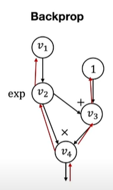
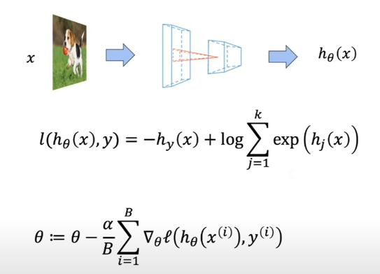

Neural network library abstractions

---

# Outline
- programming abstrctions
- high level modular library components

---

# programming abstrctions
- The programming abstraction of a framework defines the common ways to implement, extend and execute model computations
  - API to define computations
  - extend to support different kinds of models
- While the design choices may seem obvious after seeing them, it is useful to learn about the thought process, so that:
  - We know why the abstractions are designed in this way
  - Learn lessons to design new abstractions

## Case studies
- history of deep learning frameworks development
- 2014: caffe_1.0
- 2015: tensorflow_1.0
- 2016: pytorch

-There are many frameworks being development along the way that we do not have time to study: theano, torch7, mxnet, caffe2, chainer, jax …

## Forward and backward layer interface
- Example framework: Caffe 1.0
  - 2014 
  - Berkeley
  - c++

  

  ```
  class Layer:
    def forward(bottom, top):
      pass
    def backward(top, propagate_down, bottom):
      pass
  ```
- Defines the forward computation and backward(gradient) operations
  - update weight
- Used in cuda-convenet (the AlexNet framework 2012)
- Early pioneer: cuda-convnet

## Computational graph and declarative programming

- Example framework: Tensorflow 1.0
  - 2015

  

  ```
  import tensorflow as tf
  v1 = tf.Variable()
  v2 = tf.exp(v1)
  v3 = v2 + 1
  v4 = v2 * v3
  sess = tf.Session()
  value4 = sess.run(v4, feed_dict={v1: numpy.array([1]})
  ```

- First declare the computational graph
  - combination graph
  - seperation definition and computation
  - the execution part is changed based on the target tensor
  - scalable computation on different remote executor machine
- Then execute the graph by feeding input value
- Early pioneer: Theano
  - Montreal
- Static computational graph construction

# Imperative automatic differentiation
- Example framework: PyTorch (needle:)

  

  ```
  import needle as ndl
  v1 = ndl.Tensor([0])
  v2 = ndl.exp(v1)
  v3 = v2 + 1
  v4 = v2 * v3
  if v4.numpy() > 0.5:
    v5 = v4 * 2
  else:
    v5 = v4
  v5.backward()
  ```
- Executes computation as we construct the computational graph
  - define by run
- Allow easy mixing of python control flow and construction
- Early pioneer: Chainer
- Dynamic computational graph construction
  - depending on the values of the intermediate computations, we could choose to dynamically construct the computational graph

## Discussions
- What are the pros and cons of each programming abstraction?
- TF 
  - flexibility and ability to optimize
    - may have more optimization opportunity, like fuse more operators, memory reuse
  - the execution graph is changed decided by the target tensor
- Pytorch
  - more friendly
  - allows more organic mixing of Python(host language)
    - imperative programming model: stochastic depths
  - interactively debug

---

# High level modular library components
## Elements of Machine Learning
- The hypothesis class
  - mapping the input and prediction
- The loss function
  - to measure how good your prediction is
  - xgboost: regression analysis
- An optimization method
  - try to find optimized parameters within that space of possible choices



- Question: how do they translate to modular components in code?

## Deep learning is modular in nature
- Multi-layer Residual Net


- Residual block

  - directly add input onto this sequence within the box
  - highway network
  - LSTMs have like a memory cell, memorizes the past

- Linear

  - dense

- relu


## Residual Connections
- 2015. Resnet. Deep Residual Learning for Image Recognition
- 2016. ResnetV2. Identity Mapping in Deep Residual Networks

## nn.Module: Compose Things Together
- Residual block
  
  
  - tensor in
  - tensor out

- linear
  
  
  - Key things to consider:
    - For given inputs, how to compute outputs
    - Get the list of (trainable) parameters
    - Ways to initialize the parameters
  
## Loss functions as a special kind of module

  - 
    
    - Tensor in
    - scalar out
  $$ l(h_\theta(x),y) = -h_y(x) + log\sum_{j=1}^k exp(h_j(x)) $$

  - Questions
    - How to compose multiple objective functions together?
      - l1 = where is the bounding boxes
      - l2 = what class in it
      - l1 + l2
    - What happens during inference time after training?

# Optimizer
- Model
  

    - Takes a list of weights from the model perform steps of optimization
    - Keep tracks of auxiliary states (momentum)
- SGD
  $$ w_i \leftarrow w_i - \alpha g_i $$

- SGD with momentum
  $$ u_i \leftarrow \beta u_i + (1-\beta) g_i $$
  $$ w_i \leftarrow w_i - \alpha u_i $$

- Adam
  $$ u_i \leftarrow \beta_1 u_i + (1-\beta_1) g_i $$
  $$ v_i \leftarrow \beta_2 u_i + (1-\beta_2) g_i^2 $$
  $$ w_i \leftarrow w_i - \frac{\alpha u_i}{v_i^{\frac12} + \epsilon} $$

## Regularization and optimizer
- Two ways to incorporate regularization:
  - Implement as part of loss function

  $$ l = l + \lambda * |w|^2 $$ 

  - Directly incorporate as part of optimizer update

- SGD with weight decay (l2 regularization)
  - each of the weight values L2 norm is not too large
  - weight decay term
  $$ w_i \leftarrow (1-\alpha \lambda)w_i - \alpha g_i $$

## Initialization
- Initialization strategy depends on the module being involved and the type of the
parameter. Most neural network libraries have a set of common initialization routines
  - weights: uniform, order of magnitude depends on input/output
  - bias: zero
    - helps renormlize
    - uniform distributions
    - Gaussian distributions
  - Running sum of variance: one
- Initialization can be folded into the construction phase of a nn.module

## Data loader and preprocessing


- Data loading and augmentation pipeline
- We often preprocess (augment) the dataset by randomly shuffle and transform the input
  - affine transformtion
  - random rotation, jittering
  - crop and resize
  - get bigger input size -> model is robust
- Data augmentation can account for significant portion of prediction
accuracy boost in deep learning models
- Data loading and augmentation is also compositional in nature

## Deep learning is modular in nature


- nn.module help us to compose the neural network libraries
- loss function
- pass parameters and gradients to optimizer, try differnt methods
- initialization to make sure the weight values are being initialized correctly
- data loader and preprocessing feed argument to the training pipeline

## Discussions
- What are other possible examples of modular components?
  - customize one part of the modular 

## Revisit programming abstraction

- Example framework: Caffe 1.0
  ```
  class Layer:
    def forward(bottom, top):
      pass
    def backward(top,  propagate_down, bottom):
      pass
  ```

- Couples gradient computation with the module composition

## Revisit programming abstraction
- Example framework: PyTorch (needle:)


  ```
  import needle as ndl
  v1 = ndl.Tensor([1])
  v2 = ndl.exp(v1)
  v3 = v2 + 1
  v4 = v2 * v3
  ```

- Two levels of abstractions
  - Computational graph abstraction on Tensors, handles AD
  - High level abstraction to handle modular composition