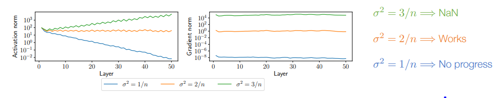
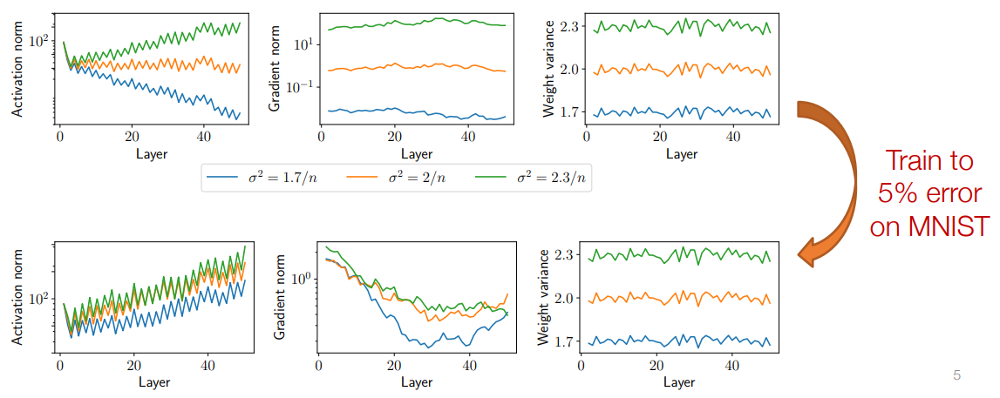
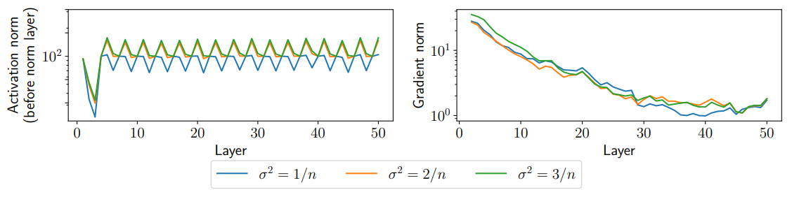
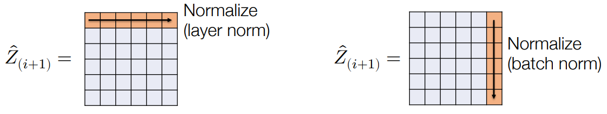
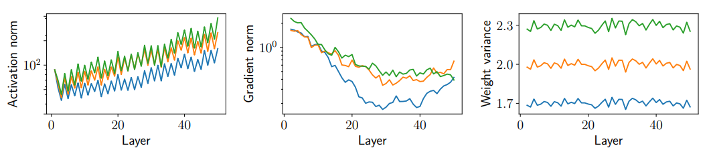

# Outline
- Normalilzation
- Regularization
- Interaction of optimization, initialization, normalization, regularization
  - Add in network to either make it perform better or to optimize better
---

# Normalilzation

## Initialization vs. optimization

- Suppose we choose 
  $$ W_i \sim N(0, \frac{c}{n}) $$
  
  - n is the number of the dimensionality of the input
  - Gaussian distribution with mean 0 and variance of c over n
  - where (for a ReLU network) c ≠ 2…
- Won’t the the scale of the initial weights be “fixed” after a few iterations of optimization?
  - No! A deep network with poorly-chosen weights will never train (at least with vanilla SGD)

  

- The problem is even more fundamental, however: even when trained successfully,
the effects/scales present at initialization persist throughout training

  

## Normalization
- Initialization matters a lot for training, and can vary over the course of training to no longer be “consistent” across layers / networks
- But remember that a “layer” in deep networks can be any computation at all…
- …let’s just add layers that “fix” the normalization of the activations to be whatever
we want!

## Layer normalization
- First idea: let’s normalize (mean zero and variance one) activations at each layer;
this is known as layer normalization

$$ \hat z_{i+1} = \sigma_i (W_i^T z_i + b_i) $$

$$ \hat z_{i+1} = \frac{\hat z_{i+1} - E[\hat z_{i+1}]}{(Var|\hat z_{i+1}| + \epsilon)^{\frac12}} $$
  - $$ E[\hat z_{i+1}] = \frac{1}{n} \sum_{j=1}^{n}(\hat z_{i+1})_j $$
    - empirical expected value
    - z_{i+1} is a vector
  - $$ Var[\hat z_{i+1}] = \frac{1}{n} \sum_{j=1}^{n}[(\hat z_{i+1})_j - E[\hat z_{i+1}]]^2 $$

- Also common to add an additional scalar weight and bias to each term (only
changes representation e.g., if we put normalization prior to nonlinearity instead)

## LayerNorm illustration
- "Fixes" the problem of varying norms of layer activations (obviously)

- In practice, for standard FCN, harder to train resulting networks to low loss
(relative norms of examples are a useful discriminative feature)
  - layer norm is taking each individual example and forcing its norm of the activations

## Batch normalization

- An odd idea: let’s consider the matrix form of our updates

$$ \hat z_{i+1} = \sigma_i (Z_i W_i + b_i^T) $$

- then layer normalization is equivalent to normalizing the rows of this matrix
  - normalizing the rows
- What if, instead, we normalize it’s columns? This is called batch normalization, as we are normalizing the activations over the minibatch
  - normalizing the column
  - think of each sort of column of this vector as sort of a single activation kind of like a single feature
  - get standardization across these features
- activations of our network don't blow up as we go deeper and deeper into the network

## Minibatch dependence

- One oddity to BatchNorm is that it makes the predictions for each example dependent on the entire batch
- Common solution is to compute a running average of mean/variance for all
features at each layer $$ \hat \mu_{i+1}, \hat \sigma_{i+1}^2 $$, and at test time normalize by these quantities

$$ (z_{i+1})_j = \frac{(\hat z_{i+1})_j - (\hat \mu_{i+1})_j}{((\hat \sigma_{i+1}^2)_j + \epsilon)^{\frac12}} $$
  - the j column
$$ \hat \mu_{i+1} = \beta \hat \mu_{i+1} + (1 - \beta)E[\hat z_{i+1}] $$

---

# Regularization

## Regularization of deep networks
- Typically deep networks (even the simple two layer network you wrote in the
homework) are overparameterized models: they contain more parameters
(individual weights values) than the number of training example training dataset
  - This means (formally, under a few assumptions), that they are capable of
fitting the training data exactly
- In “traditional” ML/statistical thinking (with a number of big caveats), this should
imply that the models will overfit the training set, and not generalize well
  - perform well on training set
  - not perfomr well on new test set
  - … but they do generalize well to test examples
  - … but not always (many larger models will often still overfit)

## Regularization
- Regularization is the process of “limiting the complexity of the function class” in order to ensure that networks will generalize better to new data; typically occurs in two ways in deep learning
- Implicit regularization refers to the manner in which our existing algorithms (namely
SGD) or architectures already limit functions considered
  - E.g., we aren’t actually optimizing over “all neural networks”, we are optimizing over all neural networks considered by SGD, with a given weight initialization
  - easy to over-fitting
- Explicit regularization refers to modifications made to the network and training
procedure explicitly intended to regularize the network

## ℓ2 Regularization a.k.a. weight decay
- Classically, the magnitude of a model’s parameters are often a reasonable proxy
for complexity, so we can minimize loss while also keeping parameters small
minimize

$$ \min_{W_{1:D}} \frac1m \sum_{i=1}^{m} l(h_{W_{1:D}(x^{(i)})}, y^{(i)}) + \frac{\lambda}{2} \sum_{i=1}^D ||W_i||_2^2 $$

- Results in the gradient descent updates:

$$ W_i := W_i - \alpha \nabla_{W_i}l(h(X),y)-\alpha \lambda W_i = (1-\alpha \lambda)W_i - \alpha \nabla_{W_i}l(h(X),y) $$

I.e., at each iteration we shrink the weights by a factor $$ (1-\alpha \lambda) $$ before taking the
gradient step

## Caveats of ℓ2 regularization
- ℓ2 regularization is exceedingly common deep learning, often just rolled into the optimization procedure as a “weight decay” term
- However, recall our optimized networks with different initializations:

- ... Parameter magnitude may be a bad proxy for complexity in deep networks 

## Dropout
- Another common regularization strategy: randomly set some fraction of the
activations at each layer to zero

$$ \hat z_{i+1} = \sigma_i (W_i^T z_i + b_i) $$

$$
(z_{i+1})_j
\begin{cases}
\cfrac {( \hat z_{i+1})_j}{1-p}, &with\ probability \ 1-p \\
0, &with\ probability \ p
\end{cases}
$$

- (Not unlike BatchNorm) seems very odd on first glance: doesn’t this massively
change the function being approximated?

## Dropout as stochastic approximation
- Dropout is frequently cast as making networks “robust” to missing activations (but
we don’t apply it at test time? … and why does this regularize network?)
- Instructive to consider Dropout as bringing a similar stochastic approximation as
SGD to the setting of individual activations

$$ \frac1m \sum_{i=1}^{m} l(h_(x^{(i))}, y^{(i)}) $$
$$ \Rightarrow \frac{1}{|B|} \sum_{i\in B} l(h_(x^{(i))}, y^{(i)}) $$

$$ z_{i+1} = \sigma_i(\sum_{i=1}^{m} W_{:,j}(z_i)_j) $$
$$ \Rightarrow z_{i+1} = \sigma_i(\frac{n}{|P|} \sum_{j \in P}^{n} W_{:,j}(z_i)_j)$$

---

# Interaction of optimization, initialization, normalization, regularization

## Many solutions … many more questions

- Many design choices meant to ease optimization ability of deep networks
  - Choice of optimizer learning rate / momentum
  - Choice of weight initialization
  - Normalization layer
  - Reguarlization
  - These factors all (of
course) interact
with each other

- And these don’t even include many other “tricks” we’ll cover in later lectures:
residual connections, learning rate schedules, others I’m likely forgetting
- …you would be forgiven for feeling like the practice of deep learning is all about
flailing around randomly with lots of GPUs

## BatchNorm: An illustrative example

- papaer: Batch Normalization: Accelerating Deep Network Training by Reducing Internal Convariate Shift

- “Here is what we know about batch norm as a field. It works because it reduces internal covariant shift. Wouldn't you like to know why reducing internal covariant shift speeds up gradient descent? Wouldn't you like to
see a theorem or an experiment? Wouldn't you like to know, wouldn't you like to see evidence that batch norm reduces internal covariant shift? Wouldn't you like to know what internal covariant shift is? Wouldn't you like to see a definition of it?”
- Ali Rahimi (NeurIPS 2017 Test of Time Talk

- paper: BatchNorm: An illustrative example

- paper: Gradient Descent on Neural Networks Typically Occurs At The Edge of Stanility

## BatchNorm: Other benefits?
- paper: Tent: fully test-time adaptation by entropy minimization

## The ultimate takeaway message
- I don’t want to give the impression that deep learning is all about random hacks: there have been a lot of excellent scientific experimentation with all the above
- But it is true that we don’t have a complete picture of how all the different empirical tricks people use really work and interact
- The “good” news is that in many cases, it seems to be possible to get similarly good results with wildly different architectural and methodological choices

