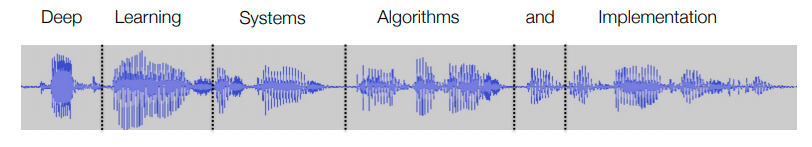

# Sequence Modeling and Recurrent Networks

# Outline
- Sequence modeling
- Recurrent neural networks
- LSTMs
- Beyond "simple" sequential models

# reference
- https://github.com/dlsyscourse/public_notebooks/blob/main/rnn_implementation.ipynb

# Sequence modeling

## Sequence modeling tasks

- In the examples we have considered so far, we make predictions assuming each
input output pair x(i), y(i) is independent identically distributed (i.i.d.)
  - there is no inherent odering
  - independent from each other
- In practice, many cases where the input/output pairs are given in a specific
sequence, and we need to use the information about this sequence to help us
make predictions
  ```
    y(1)    y(2)    y(3)
    /|\     /|\     /|\
     |       |       |
    x(1) -> x(2) -> x(3) -> ... 
  ```
  - or more commonly, denoting x_t as a whole vector
    - in time dimension
  ```
    y_1     y_2     y_3
    /|\     /|\     /|\
     |       |       |
    x_1  -> x_2  -> x_3 -> ... 
  ```
  - the x-y pairs are orderd, sequentially
  - $ x_t \in R^n $

## Example: Part of speech tagging

- Given a sequence of words, determine the part of speech of each word
  ```
     DT       JJ       JJ       NN     VBD      ???
    /|\      /|\      /|\      /|\     /|\       |
     |        |        |        |       |        |
    The  -> quick  -> brown -> fox -> jumped -> well
  ```
  - A word’s part of speech depends on the context in which it is being used, not just on the word itself
    - brown is adjective
    - fox is noun
  - dependent each other
    - well can not be predicted just from that word alone

## Example: speech to text

- Given a audio signal (assume we even know the word boundaries, and map each segment to a fix-sized vector descriptor), determine the corresponding transcription
  
  - Again, context of the words is extremely important (see e.g., any bad speech recognition system that attempts to “wreck a nice beach”)

## Example: autoregressive prediction
- A special case of sequential prediction where the elements to predict is the next element in the sequence
  ```
     quick  brown     fox     jumped   over
    /|\      /|\      /|\      /|\     /|\
     |        |        |        |       |
    The  -> quick  -> brown -> fox -> jumped 
  ```
  - Common e.g., in time series forecasting, language modeling, and other use cases
  - predict the next word

# Recurrent neural networks

## Recurrent neural networks

- Recurrent neural networks (RNNs) maintain a hidden state over time, which is a function of the current input and previous hidden state
  ```
            y_1     y_2     y_3
            /|\     /|\     /|\
             |       |       |
    h_0 ->  h_1  -> h_2  -> h_3 -> ... 
            /|\     /|\     /|\
             |       |       |
            x_1     x_2     x_3
  ```
  - input: x_1, x_2, x_3
  - predict
  - output: y_1, y_2, y_3
  - $ h_t = f(W_{hh}h_{t-1} + W_{hx}x_t + b_h) $
    - f is non-linear function
      - relu, sigmoid,...
    - $ h_t \in R^d $ 
    - $ x_t \in R^n $ 
    - $ w_{hh} \in R^{dxd} $  
    - $ w_{hx} \in R^{dxn} $ 
    - $ b_h \in R^d $
  
  - $ y_t = g(W_{yh}h_t + b_y) $
    - where f and g are activation functions
    - W_{hh}, W_{hx}, W_{yh} are weights and 
    - b_h, b_y are bias terms
    - $ y_t \in R $, real value 
    - $ w_{yh} \in R^{kxd} $  
    - $ b_y \in R^k $

  - h3 will capture all the information
    - x1, x2, x3

## How to train your RNN
- Given a sequence of inputs and target outputs (x_1,...,x_T,y*_1,...,y*_T), we can train an RNN using backpropagation through time, which just involves “unrolling” the RNN over the length of the sequence, then relying mostly on autodiff
  ```
    opt = Optimizer(params = (W_hh, W_hx, W_yh, b_h, b_y))
    h[0] = 0
    l = 0
    for t = 1,...,T:
      h[t] = f(W_hh * h[t-1] + W_hx*x[t] + b_h)
      y[t] = g(W_yh * h[t] + b_y)
      l += Loss(y[t], y_star[t])
    l.backward()
    opt.step()
  ```
  - backpropagation through time(BPTT)

## Stacking RNNs
- Just like normal neural networks, RNNs can be stacked together, treating the hidden unit of one layer as the input to the next layer, to form “deep” RNNs
- Practically speaking, tends to be less value in “very deep” RNNs than for other architectures

  ```
            y_1      y_2      y_3
            /|\      /|\      /|\
             |        |        |
            ...      ...      ...
            /|\      /|\      /|\
             |        |        |
    h2_0 -> h2_1  -> h2_2  -> h2_3 -> ... 
            /|\      /|\      /|\
             |        |        |
    h1_0 -> h1_1  -> h1_2  -> h1_3 -> ... 
            /|\      /|\      /|\
             |        |        |
            x_1      x_2      x_3
  ```
  - two main problems
    - the exploding gradient problem
    - the vanishing gradient problem

## Exploding activations/gradients
- The challenge for training RNNs is similar to that of training deep MLP networks
- Because we train RNNs on long sequences, if the weights/activation of the RNN are scaled poorly, the hidden activations (and therefore also the gradients) will grow unboundedly with sequence length
- Single layer RNN with ReLU activations, using weight initialization
  - $ W_{hh} \approx N(0,3/n) $
  - Recall that $ \sigma^2 = 2/n $ was the “proper” initialization for ReLU activations

## Vanishing activation/gradients
- Similarly, if weights are too small then information from the inputs will quickly decay with time (and it is precisely the “long range” dependencies that we would often like to model with sequence models)
- Single layer RNN with ReLU activations, using weight initialization
- $ W_{hh} \approx N(0,1.5/n) $
- Non-zero input only provided here for time 1, showing decay of information about this input over time

# Alternative Activations
- One obvious problem with the ReLU is that it can grow unboundedly; does using bounded activations “fix” this problem?
- using non-linear activations
- $ sigmoid(x) = \frac{1}{1+e^{-x}} $
  - [0,1]
- $ tanh(x) = \frac{e^x - e^{-x}}{e^x + e^{-x}} $
  - [-1,1]
- No … creating large enough weights to not cause activations/gradients to vanish requires being in the “saturating” regions of the activations, where gradients are very small ⟹ still have vanishing gradients
  
# LSTMs

## Long short term memory RNNs
- Long short term memory (LSTM) cells are a particular form of hidden unit update that avoids (some of) the problems of vanilla RNNs
- Step 1: Divide the hidden unit into two components, called (confusingly) the hidden state and the cell state

  ```
            y_1     y_2     y_3
            /|\     /|\     /|\
             |       |       |
    h_0 ->  h_1  -> h_2  -> h_3 -> ... 
            /|\     /|\     /|\
             |       |       |
            x_1     x_2     x_3
  ```
  -->
  ```
            y_1     y_2     y_3
            /|\     /|\     /|\
             |       |       |
    h_0     h_1     h_2     h_3
    ... ->  ...  -> ...  -> ... -> ...
    c_0     c_1     c_2     c_3
            /|\     /|\     /|\
             |       |       |
            x_1     x_2     x_3
  ```

## Long short term memory RNNs
- Step 2: Use a very specific formula to update the hidden state and cell state (throwing in some other names, like “forget gate”, “input gate”, “output gate” for good measure)

- $ \begin{bmatrix}
    i_t \\
    f_t \\
    g_t \\
    o_t \\
   \end{bmatrix} = 
   \begin{bmatrix}
    sigmoid \\
    sigmoid \\
    tanh \\
    sigmoid \\
   \end{bmatrix}* (W_{hh}h_{t-1} + W_{hx}x_t + b_h)
  $
  - $ c_t = c_{t-1} * f_t + i_t * g_t $
  - $ h_t = tanh(c_t) * o_t $
  - 
  - i_t: input_gate
  - f_t: forget_gate
  - g_t: gate_gate
  - o_t: output_gate
  - all gate has same size, all d-dimensional vector, $ \in R^d $
  - $ \frac{h_t}{c_t} \in R^{2d} $
    - 2 times d-dimensional vector
  - $W_{hh} \in R^{4d,4} $

## Why do LSTMs work?
- There have been a seemingly infinite number of papers / blog posts about “understanding how LSTMs work” (I find most of them rather unhelpful)
- The key is this line here:
  - $ c_t = c_{t-1} * f_t + i_t * g_t $
    - forming the current cell state, which again the cell state is just an element, a portion of the hidden state, the protion that's maintained over time part of the hidden state basically
    - c_{t-1} the previous cell state at time t
    - f_t: sigmoid,..., all containing [0,1], determines how much you forget the past cell state
  - We form $ c_t $ by scaling down $ c_{t-1} $ (remember, $ f_t $ is in $ [0,1]^n $, then adding a term to it
  - Importantly, “saturating” sigmoid activation for $ f_t $ at 1 would just pass through $ c_{t-1} $ untouched
  - ⟹ For a wide(r) range of weights,LSTMs don’t suffer vanishing gradients

## Some famous LSTMs
- A notably famous blog post in the history of LSTMs:
- http://karpathy.github.io/2015/05/21/rnn-effectiveness/
- Andrej’s blog post

```
/*
* Increment the size file of the new incorrect UI_FILTER group information
* of the size generatively.
*/
static int indicate_policy(void)
{
  int error;
  if (fd == MARN_EPT) {
    /*
    * The kernel blank will coeld it to userspace.
    */
    if (ss->segment < mem_total)
    unblock_graph_and_set_blocked();
    else
    ret = 1;
    goto bail;
  }
  segaddr = in_SB(in.addr);
  selector = seg / 16;
  setup_works = true;
  …
```
- Generation from character-by-character autoregressive model trained on Linux source code
- … trained on Latex source code
  
# Beyond "simple" sequential models

## Sequence-to-sequence models
- To give you a short glimpse of the kind of things you can do with RNNs/LSTMs beyond “simple” sequence prediction, consider the task of trying to translate between languages
- Can concatenate two RNNs together, one that “only” processes the sequence to create a final hidden state (i.e., no loss function); then a section that takes in this initial hidden state, and “only” generates a sequence

  ```
    zhe      kuai     zong     huli    <STOP>
    /|\      /|\      /|\      /|\     /|\
     |        |        |        |       |       
    h6  ->    h7  ->   h8   ->  h9 ->  h10
    |
    -------------------------------------
                                        |
     h1   ->  h2  ->   h3  ->  h4  ->  h5
    /|\      /|\      /|\      /|\     /|\
     |        |        |        |       |
    The    quick     brown    fox     <STOP> 
  ```
  - phase stop the RNN knows it should summarize the text and star ttranslate

## Bidirectional RNNs
- RNNs can use only the sequence information up until time t to predict $ y_t $
- - This is sometimes desirable (e.g., autoregressive models)
  - But sometime undesirable (e.g., language translation where we want to use “whole” input sequence)
- Bi-directional RNNs: stack a forwardrunning RNN with a backward-running RNN: information from the entire sequence to propagates to the hidden state

  ```
            y_1     y_2     y_3
            /|\     /|\     /|\
             |       |       |
            ...     ...     ...            
            /|\     /|\     /|\
             |       |       |
            h2_1 <- h2_2 <- h2_3 <- ... <- h2_{T+1}
            /|\     /|\     /|\
             |       |       |
    h1_0 -> h1_1 -> h1_2 -> h1_3 -> ...
            /|\     /|\     /|\
             |       |       |
            x_1     x_2     x_3
  ```
  - before
    - y_3 depend on x_1, x_2 and x_3
    - y_2 depend on x_1 and x_2
  - allows for essentially dependence in prediction sequence that is not just causal
    - y_2 is not just depend on x_1 and x_2, but also depent on x_3 

# Implementing recurrent networks
- Unlike convolutional networks (which required us to implement a new kind of operation), recurrent networks in theory are quite straightforward to implement: although the particular details of the "cell" for a more complex recurrent network like an LSTM seem a bit complex, it is ultimately just a collection of operators that are fairly easy to chain together in a automatic differentiation tool. However, there are a number of considerations to keep in mind when implementing recurrent networks efficiently, most steming from the fact that they are fundamentally sequential models. This means that, unlike the "normal" deep network, where we think of all operations being "easily" parallelizable over a batch of data, the data input to an LSTM need to be fed in one at a time: we cannot process the second element in a sequence until we process the first, etc.

# Implementing the LSTM cell
- One thing we pointed out in the notes, which I want to highlight here, is that matrices behind the LSTM cell are not as complex as they look. Let's look at a typical equation for an LSTM cell as it's usually written in document or papers, in this case from the PyTorch docs: https://pytorch.org/docs/stable/generated/torch.nn.LSTM.html.

- $ i_t = \sigma (W_{ii}x_i + b_{ii} + W_{hi}h_{t-1} + b_{hi}) $
- $ f_t = \sigma (W_{if}x_t + b_{if} + W_{hf}h_{t-1} + b_{hf}) $
- $ g_t = tanh (W_{ig}x_t + b_{ig} + W_{hg}h_{t-1} + b_{hg}) $
- $ o_t = \sigma (W_{io}x_t + b_{io} + W_{ho}h_{t-1} + b_{ho}) $
- $ c_t = f_t \odot c_{t-1} + i_t \odot g_t $
- $ h_t = o_t \odot tanh(c_t) $
  - where 
    - h_t is the hidden state at time t
    - c_t is the cell state at time t
    - x_t is the input at time t
    - h_{t-1} is the hidden state of the layer at time t-1 or the initial hidden state at time 0
    - i_t, f_t, g_t, o_t are the input, forget, cell, and output gates, respectively
    - \sigmaσ is the sigmoid function, and \odot is the Hadamard product.

- Those equations look awful confusing (plus they have the wrong indices in the subscripts for the  terms). But the first things to realize, which I emphasized in the notes, is that there aren't actually 8 different weights: there are two different weight. You should think of the vector
- $ \begin{bmatrix}
    i \\
    f \\
    g \\
    o \\
   \end{bmatrix}
  $
  [400]
- not four separate vectors, but as a single vector that just happens to be four times the length of the hidden unit, i.e., we really have the update
 
- $ \begin{bmatrix}
    i \\
    f \\
    g \\
    o \\
   \end{bmatrix} = 
   \begin{bmatrix}
    \sigma \\
    \sigma \\
    tanh \\
    \sigma \\
   \end{bmatrix}* (W_{hh}h_{t-1} + W_{hx}x_t + b)
  $
  - W_{hi}[400,100]
  - h_{t-1}[100]
  - W_{hx}[400,20]

 
- (where I'm unilaterally deciding to get rid of the odd choice to have two different bias terms, and relabeling the subscripts on  properly).

- This is how PyTorch does it internally anyway, as you can see if you inspect the actual class.

## Batching efficiently
- Everything works above, but if you looked a bit closer at the example above, you might have noticed some pretty odd tensor sizes. We had to pass a tensor of size (50,1,20) to the PyTorch LSTM to get a similar result as for our own (more intuitively-sized?) function. What's happening here?

- The basic issue is that, as mentioned above, the LSTM as we implemented it in our own function is inherently sequential: we need to run the lstm_cell call for time t=1 before we move to time t=2, before time t=3, etc, because the hidden unit computed at time t=1 becomes is input to time t=2. But each lstm_cell call operation as performed above is fundamentally a matrix-vector operation, and as we have seen many times before, we'd ideally like to turn this into a matrix-matrix operation so as to perform more efficient compuation.

- So, just like for the case of the MLP, for example, we're going to employ mini-batches to achieve this computational efficiency. But the key point is that the examples in these minibatches cannot be from the same sequence: they need to be from multiple different sequences (or often, in practice, from locations far apart in a single sequence).

- The form of batched samples for LSTMs
- Once we move to minibactches of samples, each with a number of timesteps (we'll assume each sample has the same number of timesteps for now, but this will be dealt with shortly), then we need to store input that has a batch, time, and input dimension. Most naturally, this would look something like the following:

  - X[NUM_BATCHES][NUM_TIMESTEPS][INPUT_SIZE]
  - X[:,t,:], that would not be contiguous in memory

- which we could call NTC format (this isn't all that common for LSTMs, but it's analogous to the NHWC format we discussed for images). However, PyTorch natively uses the "TNC" format for LSTMs, that is, it stores the tensor in the order:

  - X[NUM_TIMESTEPS][NUM_BATCHES][INPUT_SIZE]
  - X[t,:,:]

- Why does it do this? The batch dimension is always first in any other setting in PyTorch, and indeed there's even now an option to use this "batch first" format for LSTMs, though it isn't the default.

- The reason is due to memory locality. In order to effectively batch the operations of an LSTM into matrix-matrix product form, we want to perform the matrix multiplications

 - $ \begin{bmatrix}
    I \\
    F \\
    G \\
    O \\
   \end{bmatrix} = 
   \begin{bmatrix}
    \sigma \\
    \sigma \\
    tanh \\
    \sigma \\
   \end{bmatrix}* (XW_{hi} + HW_{hh} + b)
  $
 
 
  - where we're considering  here to be an  matrix, and  to be  where  is the hidden dimension (we're also implicitly transposing the matrices from their forms above ... this is why PyTorch lists them as  in the docs, even though that's not really correct for the vector form it's showing).

  - But in order to have each  and  (over all batches, for a single timestep) be contiguous in memory, we need to use the THC ordering and then select X[t] and H[t] as the relevant indices. Let's see how this looks in an implementation.


- If we were to store the matrices in NTC(X[NUM_TIMESTEPS][NUM_BATCHES][INPUT_SIZE]) ordering, and e.g., using the matrix multiplication we will consider in Homework 3, where matrices need to be compact in memory before performing multiplication, we would have to be copying memory around during each update. The TNC format fixes this (and even if we were to develop a more efficient multiplication strategy that could directly consider strided matrices, the NTC format would still sacrifice memory locality). PyTorch (and needle, as you will implement on Homework 4) will thus the TNC route, and sacrifice a few people being confused the first time they use LSTMs.

## Packed sequences
- There is still one substantial problem with the approach above: the tensor form requires that each sequence in the batch be the same size. This is often explicitly not the case for RNNs, where e.g., one may want to use an RNN to process individual sentences of text, individual audio signals, etc. A large benefit of the RNN for these settings is that the sequences can all be different lengths, yet an RNN can process them all similarly. Thus, we have a common setting where the different sequences in a minibatch might be different lengths.

- One "simple" way to deal with this is simply to zero-pad the input sequences to the size of the longest sequence. That is, we can place all the sequences in a single X[MAX_TIMESTEPS][BATCH][DIMENION], replace all inputs that occur after the end of each sequence with zeros, and then after-the-fact extract the hidden unit representation at the effective end of each sequence (or at all valid points in the sequence). Since this takes advantage of "full, equal sized" matrix multiplications at each step, this is reasonable solution for it's simplicity).

- However, if the sequences in a batch are very different sizes, it should be acknowledged that this can ultimately be inefficient to run all the operations of the LSTM on what amount to a lot of meaningless data full of just zeros. To get around this, an alternative is to support "packed sequences". This represents the input as a 2D tensor

  - X[sum_batch TIMESTEPS(batch)][DIMENSION]
  
  - that lumps together elements in both the batch and time dimensions.

- In order to still exploit contiguous memory, we still want to group together elements by timestep, so this format contains first all inputs for all sequences at time 1 (they will all exist here across all samples), followed by all inputs for all sequences at time 2 (only for those that actually exist), etc. Then, in addition, there needs to be a int time_indexes[MAX_TIMESTEPS] variable that points to the starting index of the batch for each timestep.

- We won't include the code to do this here, as it involves a bit more bookkeeping to keep everything in place, but it should be apparent that for the cost of a bit more additional indexing, you can run the LSTM on only those portions of a sequence that actually exist. Whether or not this is ultimately beneficial depends on how much you're able to saturate the compute hardware at the later "sparser" stages of the processing.


## Training LSTMs: Truncated BPTT and hidden repackaging
- Now that we have covered the basics of LSTM creation, we're going to briefly mention how to train these systems in practice. As this involves actually running the LSTM code in a autodiff tool, we're going to instead just include pseudo-code for these ideas here, but you'll implement them within needle for the final homework.

- First, we should emphasize one main point, that the majority of implementing training in a recurrent neural network "just" involves running the RNN under an automatic differentiation tool, and using autodiff to find the gradient of all parameters with respect to some loss. That is, using roughly the notation from the above (i.e., with the lstm call that run over an entire (batch of) sequences, we could summarize the training procedure as the following:
  ```
    def train_lstm(X, Y, h0, c0, parameters)
      H, cn = lstm(X, h0, c0, parameters)
      l = loss(H, Y)
      l.backward()
      opt.step()
  ```
- For a multi-layer LSTM, we actually have some choice in determinining in what "order" we run it: do we run a full layer first (over all time), and then iterate over depth? Or do we run all depth first for a single time step, and then iterate over time? While both are options, it's conceptually simpler (because we can re-use the same function above) to follow the first option, i.e., to just run each LSTM over the full sequence and then iterate over layers, i.e.,
  ```
  def train_lstm(X, Y, h0, c0, parameters)
    H = X
    for i in range(depth):
        H, cn = lstm(H, h0[i], c0[i], parameters[i])
    l = loss(H, Y)
    l.backward()
    opt.step()
  ```
- This training process (for both single and multi-layer cases) is known as "backpropagation through time" (BPTT), as we're essentially doing backprop (but automatically via the autodiff framework) over each time step in the sequence.


## Long sequences and truncated BPTT
- The process above works fine conceptually, but what happens in the case that we have a very long sequence? For instance, in many language modeling tasks the true underlying sequence could be a document with thousands of words or audio signals that span many minutes. Trying to train all of these in a "single" pass of BPTT would be:
- Computationally/memory-wise infeasible (because we have to keep the whole computation graph in memory over the entire sequence).
- Inefficient for learning. Just like batch gradient descent is inefficient from a learning standpoint relative to SGD, taking a single gradient step for an entire sequence is very inefficient from a learning perspective: we - have to do a ton of work to get a single parameter update.
Thus, the simple solution is just to divide the sequence in multiple shorter blocks. That is, we train the the LSTM on segments of the full sequence. This could look something like the following.
```
  for i in range(0,X.shape[0],BLOCK_SIZE):
    h0, c0 = zeros()
    train_lstm(X[i:i+BLOCK_SIZE], Y[i:i+BLOCK_SIZE], 
               h0, c0, parameters)
```
- This works, and "solves" the problem of long sequence lengths. But it is also unsatisfying: we got rid of long sequences by just chopping them into shorter sequences. And this ignores the fact that it is precisely the long term dependencies (beyond BLOCK_SIZE) that are often most interesting in sequence models, i.e., language models that "remember" the general context of the words they are generating, etc.

## Hidden repackaging
- The way around this is to use what is called "hidden repackaging". At the end of running an LSTM on a sequence, we have the final hidden units (hidden and cell units) of the LSTM. These embed the "current" state of the system, in a way. We can't continue to continue to differentiate through these variables in the autodiff graph, but we can input their raw values as the  and  variables into the LSTM run on the next chunk of data. To do this, we'd want to adjust our LSTM training code to return these variables, but detached from their gradients.
```
  def train_lstm(X, Y, h0, c0, parameters)
    H, cn = lstm(X, h0, c0, parameters)
    l = loss(H, Y)
    l.backward()
    opt.step()
    return H[-1].data, cn.data
```
- We then use these values (instead of zeros), as the initial state of the LSTM in subsequent training loops.
```
  h0, c0 = zeros()
  for i in range(0,X.shape[0],BLOCK_SIZE):
    h0, c0 = train_lstm(X[i:i+BLOCK_SIZE], Y[i:i+BLOCK_SIZE], h0, c0, parameters)
```
- It's important to emphasize that this process is still running truncated BPTT, as we're only computing gradients through a small portion of the full sequence. But it's somewhat of a "middle ground" between doing full BPTT and always re-initializing the initial hidden states to zeros: the future LSTM states can get information from longer term context from the LSTM, and can use this to make its predictions of the future. But it cannot assess how changing the parameters of the LSTM would have changed this past initial state.