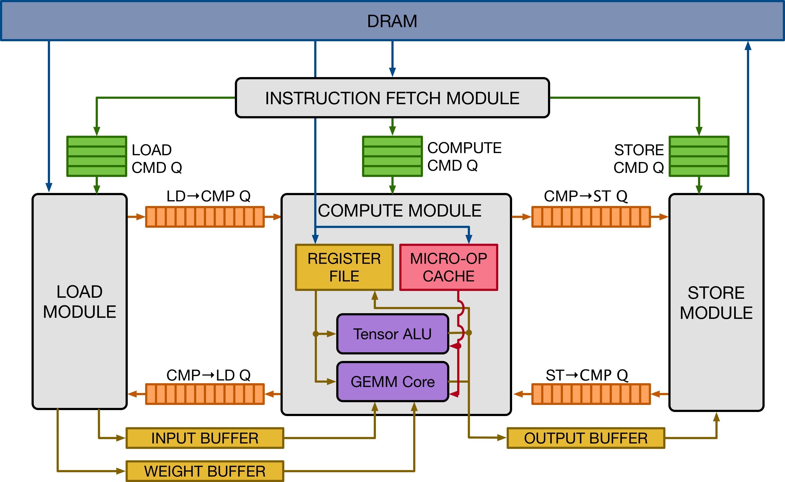
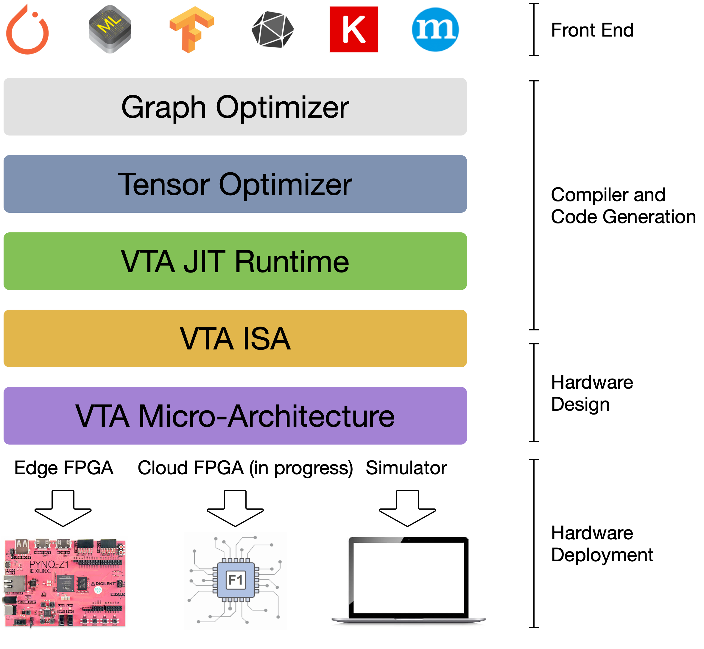
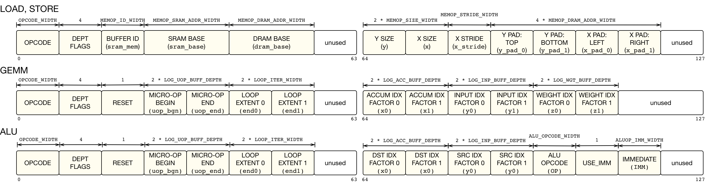
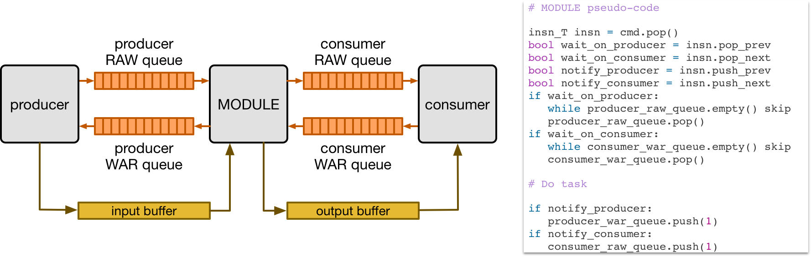
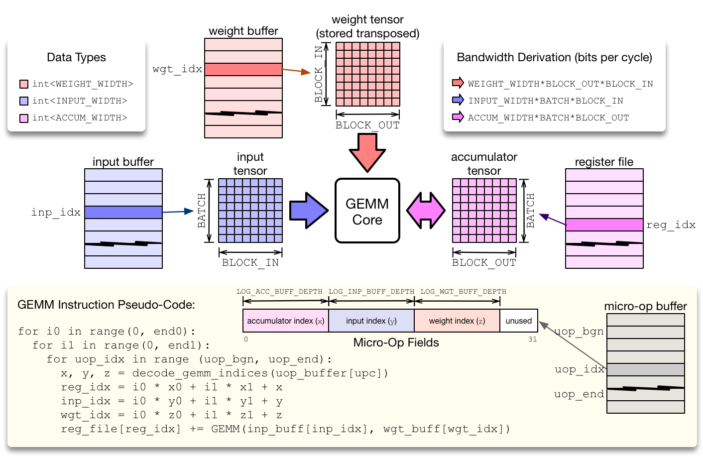
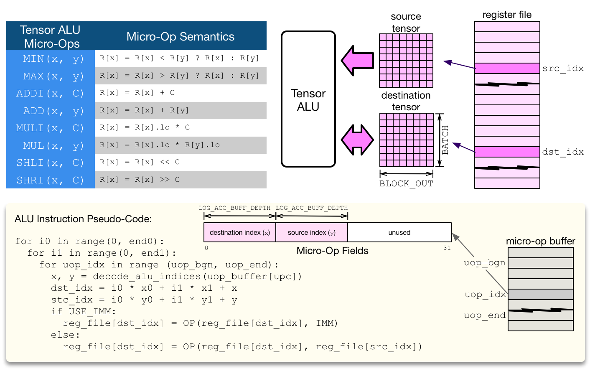
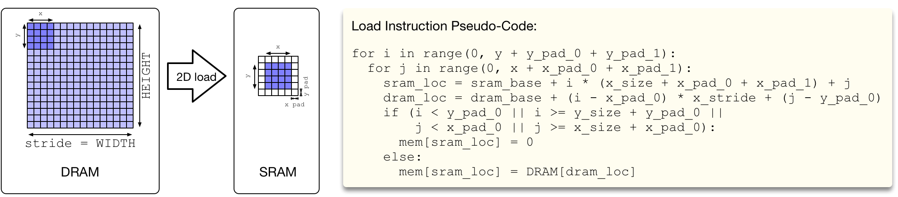
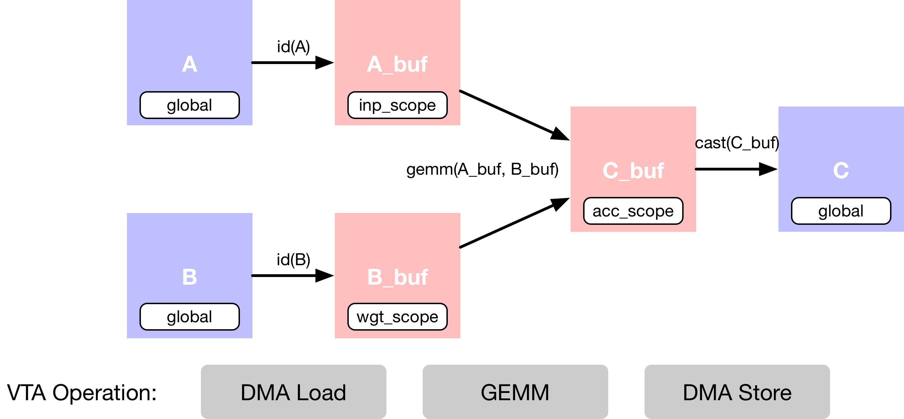
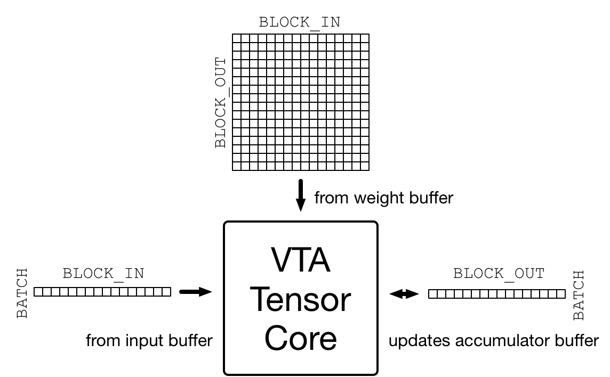
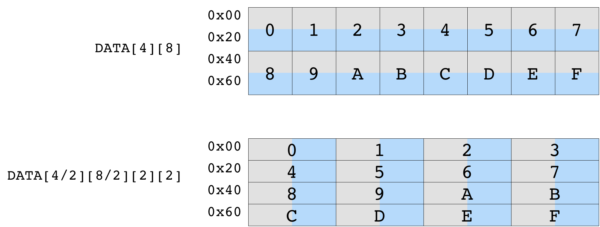

# Versatile Tensor Accelerator(VTA)
  - https://tvm.apache.org/docs/topic/vta/index.html
  - 

# install
  - export VTA_HW_PATH=$TVM_PATH/3rdparty/vta-hw
  - echo 'set(USE_VTA_FSIM ON)' >> build/config.cmake
  - cd build && cmake .. && make & & make install
  - export PYTHONPATH=/tvm/vta/python:${PYTHONPATH}
  - python vta/tests/python/integration/test_benchmark_topi_conv2d.py

# VTA Design and Developer Guide
  - 
  - tvm/3rdparty/vta-hw/config/vta_config.json
    | Attribute | Format | Desciption | example |
    | --- | --- | --- | --- |
    | TARGET | string | the TVM device target | sim |
    | HW_VER | string | VTA hardware version number | 0.0.2 | 
    | LOG_INP_WIDTH | Int(log2) | Input data type signed integer width | $$3,2^3=8,8bits$$ | 
    | LOG_WGT_WIDTH | Int(log2) | Weight data type signed integer width | $$3,2^3=8,8bits$$ | 
    | LOG_ACC_WIDTH | Int(log2) | Accumulator data type signed integer width | $$5,2^5=32,32bits$$ | 
    | LOG_BATCH | Int(log2) | VTA matrix multiply intrinsic input/output dimension 0 | $$0,2^0=1, M $$ | 
    | LOG_BLOCK | Int(log2) | VTA matrix multiply inner dimensions | $$4,2^4=16, K and N $$ | 
    | LOG_UOP_BUFF_SIZE | Int(log2) | Micro-op on-chip buffer in Bytes | $$15,2^15=32768, 32KB $$ |
    | LOG_INP_BUFF_SIZE | Int(log2) | Input on-chip buffer in Bytes | $$15,2^15=32768, 32KB $$ |
    | LOG_WGT_BUFF_SIZE | Int(log2) | Weight on-chip buffer in Bytes | $$18,2^18=262144, 256KB $$ |
    | LOG_ACC_BUFF_SIZE | Int(log2) | Accumulator on-chip buffer in Bytes | $$17,2^17=131072,128KB $$ |

# VTA Hardware Guide
## HLS Hardware Source Organization
  - tvm/3rdparty/vta-hw/hardware/xilinx/src/vta.h
    - fetch
    - load
    - compute
    - store
    - vta
  - tvm/3rdparty/vta-hw/include/vta/hw_spec.h
    - VTAInsn
      - VTAGenericInsn
      - VTAMemInsn
      - VTAGemInsn
      - VTAAluInsn
    - VTAUop

# Architectural Overview
## Instruction Set Architecture(ISA)
  - 
  - LOAD, STORE
    - 0:63
      - OPCODE
      - DEPT FLAGS;4
      - BUFFER ID(sram_mem)
      - SRAM BASE(sram_base)
      - DRAM BASE(dram_base)
      - unused
    - 64:127
      - Y SIZE(y)
      - X SIZE(x)
      - X STRIDE(x_stride)
      - Y_PAD:TOP(y_pad_0)
      - Y_PAD:BOTTOM(y_pad_1)
      - Y_PAD:LEFT(x_pad_0)
      - Y_PAD:RIGHT(x_pad_1)
  - GEMM
    - 0:63
      - OPCODE
      - DEPT FLAGS;4
      - RESET;1
      - MICRO-OP BEGIN(uop_bgn)
      - MICRO-OP END(uop_end)
      - LOOP EXTENT 0(end0)
      - LOOP EXTENT 1(end1)
      - unused
    - 64:127
      - ACCUM IDX FACTOR 0(xo)
      - ACCUM IDX FACTOR 1(x1)
      - INPUT IDX FACTOR 0(y0)
      - INPUT IDX FACTOR 1(y1)
      - WEIGHT IDX FACTOR 0(z0)
      - WEIGHT IDX FACTOR 1(z1)
      - unused
  - ALU
    - 0:63
      - OPCODE
      - DEPT FLAGS;4
      - RESET;1
      - MICRO-OP BEGIN(uop_bgn)
      - MICRO-OP END(uop_end)
      - LOOP EXTENT 0(end0)
      - LOOP EXTENT 1(end1)
      - unused
    - 64:127
      - DST IDX FACTOR 0(xo)
      - DST IDX FACTOR 1(x1)
      - SRC IDX FACTOR 0(y0)
      - SRC IDX FACTOR 1(y1)
      - ALU OPCODE(op)
      - USE_IMM;1
      - IMMEDIATE(IMM)
      - unused

## Dataflow Execution
  - 
  - deepependence FIFO queues
    - read-after-write(RAW)
    - write-after-read(WAR)

## Pipeline Expandability
  - load-compute-store
  - separating the tensor ALU from the GEMM core 
    - pros
      - maximize the utilization of the GEMM core
      - load-gemm-activate-store
    - cons
      - add sttorage and extra logic

# Microarchitectural Overview
  - tvm/3rdparty/vta-hw/hardware/xilinx/src/vta.cc
## Fetch Module
  - VTA to CPU
    - control
    - insn_count
    - insns
  - decode instructions
  - push instructions into command queues
      - feed into load, comopute and store modules
      - store
      - gemm & alu
      - load 
        - micro-op kernels or register file data
        - proceessed by the commpute mode
      - load
        - input or weight data
        - proceessed by the load mode
## Compute Module
  - RISC processor
    - tensor registers 
  - micro-ops
    - alu
    - gemm   
  - two-level nested loop
    - compute the location via an affine function
    - reduce micro-kernel instruction footprint
    - avoid control-flow instructions(conditional jumps)
  - 
    - ```python
      for i0 in range(0,end0):
        for i1 in range(0,end1):
          for uop_idx in range(uop_bgn, uop_end):
            x,y,z = decode_gemm_indices(uop_buffer[upo])
            reg_idx = i0*x0 + i1*x1 + x
            inp_idx = i0*y0 + i1*y1 + y
            wgt_idx = i0*z0 + i1*z1 + z
            reg_file[reg_idx] += GEMM(inp_buf[inp_idx], wgt_buf[wgt_idx])
      ```
  - 

    | tensor alu micro-ops | micro-op semantics |
    | --- | --- |
    | min(x,y) | r[x] = r[x]<r[y] ? r[x] : r[y] |
    | max(x,y) | r[x] = r[x]>r[y] ? r[x] : r[y] |
    | addi(x,c) | r[x] = r[x] + c |
    | add(x,y) | r[x] = r[x] + r[y] |
    | muli(x,c) | r[x] = r[x].lo + c |
    | mul(x,y) | r[x] = r[x].los + r[y].lo |
    | shli(x,c) | r[x] = r[x] << c |
    | shri(x,c) | r[x] = r[x] >> c |

    - ```
      for i0 in range(0, end0):
        for i1 in range(0, end1):
          for uop_idx in range(uop_bgn, uop_end):
            x, y = decode_alu_indices(uop_buffer[upc]):
            dst_idx = i0*x0 + i1*x1 + x
            src_idx = i0*y0 + i1*y1 + y
            if USE_IMM:
              reg_file[dst_idx] = op(reg_file[dst_idx], IMM)
            else:
              reg_file[dst_idx] = op(reg_file[dst_idx], reg_file[src_idx])
      ```
    - op
      - activation
      - normalization
      - pooling
    - computation throughput
      - lack of read-ports
      - register file wide = 32bit
## Load and Store Modules
  - 
  - dram -> sram
  - 2d padding
  - ```
    for i in range(0, y + y_pad_0 + y_pad_1):
      for j in range(0, x + x_pad_0 + x_pad_1):
        sram_loc = sram_base + i*(x_size + x_pad_0 + x_pad_1) + j
        dram_loc = dram_base + (i - x_pad_0) * x_stride + (j - y_pad_0)
        if (i < y_pad_0 || i >= y_size + y_pad_0 || 
            j < x_pad_0 || j >= x_size + x_pad_0):
            mem[sram_loc] = 0
        else:
          mem[sram_loc] = dram[dram_loc]
    ```


# Simple Matrix Multiply
## Computation Declaration
  - 
  - main memory DRAM
    - A
    - B
    - C
  - on-chip buffers SRAM
    - A_buf
    - B_buf
    - C_buf
## VTA tensorcore
  - 
    - activation[BATCH,BLOCK_IN]
    - weight_T[BLOCK_OUT,BLOCK_IN]
    - output[BATCH,BLOCK_OUT]
  - 
    - DATA[4][8]
    - DATA[4/2][8/2][2][2]
  - Example
    - vector-matrix multiply
      - activation[1,16], narrow 8-bit integers
      - weight[16,16], narrow 8-bit integers
      - output[1,16], standard 32-bit integer

## Matrix Multiplication
  - reduction

## Casting results

## Scheduling the computation
  - dma: globally-scoped -> locally-scoped
    ```
    allocate(A_buf: Pointer(global int8), int8, [256]), storage_scope = global;
    -->
    s[A_buf].set_scope(env.inp_scope)
    -->
    allocate(A_buf: Pointer(local.inp_buffer int8), int8, [256]), storage_scope = local.inp_buffer;
    ``` 
  - tensor matrix multiplication
  - VTA's On-Chip SRAMs
    - inp_scope, read-only
    - wgt_scope, read-only
    - acc_scope, read/write

## DMA transfers
  - compute_at
  - pragma
    ```
    for (i3: int32, 0, 16) {
      A_buf_1: Buffer(A_buf, int8, [16], [], scope="local.inp_buffer", align=16)[i3] = A[((ko*16) + i3)]
    }
    -->
    s[A_buf].pragma(s[A_buf].op.axis[0], env.dma_copy)
    -->
    attr [IterVar(i0: int32, (nullptr), "DataPar", "")] "pragma_dma_copy" = 1;
    for (i3: int32, 0, 16) {
      A_buf_1: Buffer(A_buf, int8, [16], [], scope="local.inp_buffer", align=16)[i3] = A[((ko*16) + i3)]
    }
    ```

## tensorization
  - init
    ```
    for (co.init: int32, 0, 16) {
      for (ci.init: int32, 0, 16) {
        C_buf_1: Buffer(C_buf, int32, [256], [], scope="local.acc_buffer", align=16)[((co.init*16) + ci.init)] = 0
      }
    }
    -->
    attr [IterVar(vta: int32, (nullptr), "ThreadIndex", "vta")] "coproc_scope" = 2 {
      attr [IterVar(vta, (nullptr), "ThreadIndex", "vta")] "coproc_uop_scope" = "VTAPushGEMMOp" {
        @tir.call_extern("VTAUopLoopBegin", 16, 1, 0, 0, dtype=int32)
        @tir.vta.uop_push(0, 1, 0, 0, 0, 0, 0, 0, dtype=int32)
        @tir.call_extern("VTAUopLoopEnd", dtype=int32)
      }
      @tir.vta.coproc_dep_push(2, 1, dtype=int32)
    }
    ```
  - load A & B
    ```
    attr [IterVar(i0: int32, (nullptr), "DataPar", "")] "pragma_dma_copy" = 1;
    for (i3: int32, 0, 16) {
      A_buf_1: Buffer(A_buf, int8, [16], [], scope="local.inp_buffer", align=16)[i3] = A[((ko*16) + i3)]
    }
    attr [IterVar(i0_1: int32, (nullptr), "DataPar", "")] "pragma_dma_copy" = 1;
    for (i0_1, 0, 16) {
      for (i2: int32, 0, 16) {
        for (i3_1: int32, 0, 16) {
          let cse_var_1: int32 = (i2*16)
          B_buf_1: Buffer(B_buf, int8, [4096], [], scope="local.wgt_buffer", align=256)[(((i0_1*256) + cse_var_1) + i3_1)] = B[((((i0_1*4096) + (ko*256)) + cse_var_1) + i3_1)]
        }
      }
    }
    -->
    attr [IterVar(vta, (nullptr), "ThreadIndex", "vta")] "coproc_scope" = 1 {
      @tir.vta.coproc_dep_pop(2, 1, dtype=int32)
      @tir.call_extern("VTALoadBuffer2D", @tir.tvm_thread_context(@tir.vta.command_handle(, dtype=handle), dtype=handle), A_2, ko, 1, 1, 1, 0, 0, 0, 0, 0, 2, dtype=int32)
      @tir.call_extern("VTALoadBuffer2D", @tir.tvm_thread_context(@tir.vta.command_handle(, dtype=handle), dtype=handle), B_2, ko, 1, 16, 16, 0, 0, 0, 0, 0, 1, dtype=int32)
      @tir.vta.coproc_dep_push(1, 2, dtype=int32)
    }
    ```
  - compute
    ```
    for (co: int32, 0, 16) {
      for (ci: int32, 0, 16) {
        for (ki: int32, 0, 16) {
          let cse_var_2: int32 = ((co*16) + ci)
          C_buf_1[cse_var_2] = (C_buf_1[cse_var_2] + (cast(int32, A_buf_1[ki])*cast(int32, B_buf_1[(((co*256) + (ci*16)) + ki)])))
        }
      }
    }
    -->
    attr [IterVar(vta, (nullptr), "ThreadIndex", "vta")] "coproc_scope" = 2 {
      @tir.vta.coproc_dep_pop(1, 2, dtype=int32)
      attr [IterVar(vta, (nullptr), "ThreadIndex", "vta")] "coproc_uop_scope" = "VTAPushGEMMOp" {
        @tir.call_extern("VTAUopLoopBegin", 16, 1, 0, 1, dtype=int32)
        @tir.vta.uop_push(0, 0, 0, 0, 0, 0, 0, 0, dtype=int32)
        @tir.call_extern("VTAUopLoopEnd", dtype=int32)
      }
      @tir.vta.coproc_dep_push(2, 1, dtype=int32)
    }
    ```
  - store
    ```
    attr [IterVar(i0_2: int32, (nullptr), "DataPar", "")] "pragma_dma_copy" = 1;
    for (i1: int32, 0, 16) {
      for (i3_2: int32, 0, 16) {
        let cse_var_3: int32 = ((i1*16) + i3_2)
        C[cse_var_3] = cast(int8, C_buf_1[cse_var_3])
      }
    }
    -->
    @tir.vta.coproc_dep_push(2, 3, dtype=int32)
    @tir.vta.coproc_dep_pop(2, 1, dtype=int32)
    attr [IterVar(vta, (nullptr), "ThreadIndex", "vta")] "coproc_scope" = 3 {
      @tir.vta.coproc_dep_pop(2, 3, dtype=int32)
      @tir.call_extern("VTAStoreBuffer2D", @tir.tvm_thread_context(@tir.vta.command_handle(, dtype=handle), dtype=handle), 0, 4, C_2, 0, 16, 1, 16, dtype=int32)
    }
    @tir.vta.coproc_sync(, dtype=int32)
    ```


## TVM compilation
  - vta.build
    ```
    target = tvm.target.Target("ext_dev", host="llvm")
    my_gemm = vta.build(s, [A, B, C], target, name="my_gemm")
    ```
  - tvm/vta/python/vta/build_module.py(111)build()
  - tvm/python/tvm/driver/build_module.py(140)build()

## Running
  - remote execution on Pynq
  - tvm.nd.array
    - A_orig[1, 256]
    - B_orig[256, 256]
    - A_packed[1, 16, 1, 16]
    - B_packed[16, 16, 16, 16]
    - A_nd[1, 16, 1, 16]
    - B_nd[16, 16, 16, 16]
    - C_nd[1, 16, 1, 16]
  - f()
    - f(A_nd, B_nd, C_nd)
  - numpy()
    - np.dot
  - simulator
    - tvm/vta/python/vta/testing/simulator.py

## Verifying
  - cd tvm/vta/tutorials;python matrix_multiply.py


